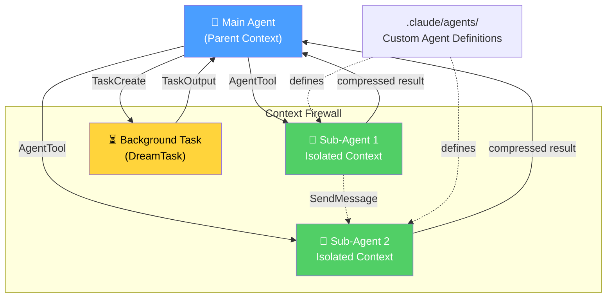

> **Book**: Claude Code VS OpenCode: Architecture, Design and The Road Ahead
> **Chapter**: 11 — Claude Code's Commercial Design
> **Model**: openai/gpt-5.4
> **Generated**: 2026-04-01
> **Token Usage**: unavailable in current environment

# 11.6 Bridge and Coordinator Mode

Claude Code’s commercial design becomes especially distinctive when we look at **Bridge**, **Coordinator mode**, and the related **assistant mode (KAIROS)**. These are not just interface features. They are operating modes that extend the agent beyond a single local REPL. In the source tree, this capability spans `src/bridge/` and `src/coordinator/`.

**Bridge** is the remote-control substrate. The user-facing entry point is `claude remote-control`, while the implementation is spread across files such as `bridgeMain.ts`, `initReplBridge.ts`, `replBridge.ts`, `bridgeApi.ts`, and session-spawning utilities. Architecturally, Bridge allows a local Claude Code session to become remotely accessible from the web or mobile surfaces. This means the CLI is no longer a purely local interface; it can become a resumable endpoint in a wider Anthropic ecosystem.

That capability matters for two reasons. First, it enables **remote session support**. A session can persist, be resumed, and be managed across devices rather than dying with the terminal window. Second, it gives Claude Code a pathway into enterprise and mobile workflows where local shell presence is inconvenient. The command-line product effectively becomes a remotely addressable work session.

The implementation reflects real product maturity. `bridgeMain.ts` handles environment registration, spawning, work dispatch, heartbeat logic, token refresh scheduling, timeouts, worktree creation, and session continuation flags such as `--continue` and `--session-id`. In other words, Bridge is not a simple websocket tunnel. It is session infrastructure.

**Coordinator mode** addresses a different problem: not remote access, but **multi-agent orchestration**. In `coordinatorMode.ts`, Claude Code defines a coordinator persona whose job is to launch workers, synthesize findings, direct implementation, and manage verification. The file even includes detailed guidance about when to parallelize workers, when not to delegate trivial tasks, how worker notifications arrive, and how to continue or stop workers. This is a formal orchestration layer, not an improvised “spawn an agent” helper.

The significance is that Claude Code productizes a pattern that many open-source agent users try to build manually: one supervising agent coordinating several worker agents. The coordinator is given explicit rules for concurrency, synthesis, verification rigor, and worker lifecycle. This is a notable commercial move because it turns multi-agent work from a power-user experiment into a supported operating mode.

Then there is **assistant mode**, associated with **KAIROS** gates throughout the codebase. KAIROS is tied to long-running, continuous interaction patterns: scheduled check-ins, resumed sessions, remote-control continuation, brief views, and related behavior that makes the agent feel less like an isolated prompt-response loop and more like an ongoing collaborator. From an architectural perspective, assistant mode shifts the frame from “single request execution” to “persistent relationship with the session.”

These features are especially important because they are still relatively rare in coding agents. OpenCode and Oh-My-OpenCode are stronger in open extensibility and community-driven orchestration experimentation. Claude Code is stronger in **turning advanced orchestration into a product surface**. Bridge gives remote continuity. Coordinator mode gives supervised parallelism. Assistant mode gives longer-lived engagement. Together they form a suite of enterprise and power-user capabilities that go beyond the classic local-agent mold.

The strategic lesson is clear. The future of coding agents is not only better reasoning inside one context window. It is better **session topology**: local and remote, single-agent and multi-agent, synchronous and long-running. Claude Code’s Bridge and Coordinator modes are important precisely because they show how a commercial system begins to design that topology explicitly.

## Deep Dive: Claude Code's Sub-Agent Architecture

> **Model**: openai/gpt-5.4  
> **Token Usage**: unavailable in current environment

The previous discussion framed **Bridge** and **Coordinator mode** as product surfaces. But underneath those surfaces sits a deeper idea: Claude Code treats multi-agent work as a first-class runtime capability rather than a prompt trick. That distinction matters. In many agent systems, “sub-agent” really means “the main agent writes a chunk of text that imitates delegation.” Claude Code goes further. It provides explicit spawning, task tracking, result retrieval, and constrained role definition. In practice, this creates a structured sub-agent architecture with its own design philosophy.

The best way to understand that philosophy is through the lens of **context management**. A sub-agent is not valuable merely because it is another model call. It is valuable because it can operate with a different objective, different tool permissions, different temporal lifecycle, and—most importantly—a different context boundary. Claude Code’s architecture consistently pushes toward the idea that one problem should not automatically drag the entire conversation history into every worker. That is why the system is best understood as an implementation of a **context firewall**: a deliberate boundary that prevents irrelevant or noisy history from contaminating specialized work.

### 1. AgentTool: spawning a new agent behind a context firewall

At the center of this design is **AgentTool**. Conceptually, AgentTool is Claude Code’s canonical sub-agent launcher. The parent agent uses it to create another agent instance and delegate a task. But the key point is not just spawning. The key point is *how* the spawned agent is framed.

The child does not simply inherit the parent’s full transcript. Instead, it receives a more controlled package: the delegated goal, relevant instructions, selected constraints, and a fresh working context. This is what people in modern agent engineering often call a **context firewall**. The term is not a classical textbook expression, so it deserves explanation. In networking, a firewall filters traffic crossing a boundary. In agent systems, a context firewall filters informational baggage crossing from one agent process to another. It is an architectural mechanism for saying: “Take the task, not the entire psychological residue of the session.”

This has several benefits. First, it reduces distraction. A research-oriented worker does not need every earlier implementation debate. Second, it improves robustness. If the parent took a wrong turn, not all of that confusion has to be inherited. Third, it makes roles clearer. A worker can behave like a worker instead of half-replaying the parent’s indecision. Finally, it is good for token economics: less inherited context means more room for actual work.

The tradeoff is equally important. A clean child context may lose subtle tacit knowledge accumulated by the parent. If the parent learned three failed approaches earlier in the session, a fully isolated worker may rediscover them. Claude Code accepts that tradeoff because it prioritizes reliability and role purity. In other words, it would rather risk some duplicated discovery than allow cross-task contamination to silently degrade reasoning quality.

### 2. Compressed return path: why results matter more than raw transcripts

AgentTool also implies a return contract. The child agent is not supposed to dump an unbounded transcript back into the parent. Instead, it returns a compressed result: findings, conclusions, recommended actions, possibly structured summaries. This is architecturally crucial. If every sub-agent returned its full chain of exploration, the parent context would quickly collapse under its own weight.

So Claude Code’s design is asymmetric in a productive way. Outbound delegation is selective; inbound reintegration is compressed. That means the parent works more like a coordinator reading reports than like a memory sink swallowing raw cognition. This is a major difference between “multi-call prompting” and real orchestration. Real orchestration needs *bandwidth control* between roles.

Bandwidth control is another non-classical term worth clarifying. In distributed systems, bandwidth describes how much data can move between nodes. In agent systems, the equivalent question is how much reasoning artifact should travel between contexts. Too little transfer and the system fragments. Too much transfer and every worker pollutes every other worker. Claude Code’s sub-agent system leans toward disciplined summarization.

### 3. Custom agents in `.claude/agents/`: declarative specialization

Claude Code’s sub-agent model becomes more interesting when we look at **custom agents**. These are defined in `.claude/agents/` as Markdown files with YAML frontmatter. That format is deceptively simple but strategically important. It means specialization is not hard-coded only in TypeScript classes or internal runtime enums. It is also exposed as a **declarative artifact** that users or teams can author.

A custom agent definition can typically express several dimensions:

- agent name and description,
- a system prompt or role framing,
- allowed tools or tool restrictions,
- model preference,
- invocation metadata for slash commands or agent selection.

This is Claude Code’s closest analogue to OMO’s specialized agents such as **Oracle**, **Explore**, and **Librarian**. But the implementation philosophy differs. OMO’s agents are more programmatically embedded: factory functions, routing logic, fallback chains, category resolution, and runtime prompt builders are part of the orchestration engine itself. Claude Code’s model is more declarative. The agent is described as content, and the runtime interprets that content.

That distinction matters because it changes who owns extensibility. Declarative agent files are easier to inspect, version, and share. They are friendlier to teams that want policy-readable specialization. Programmatic agent systems are often more powerful because they can encode richer logic, fallback trees, and dynamic assembly. So the contrast is not “one is better.” It is “one optimizes legibility and packaging, the other optimizes orchestration logic density.”

### 4. Task Tools: sub-agents that do not block the parent

If AgentTool is the primary spawn mechanism, the **Task Tools** are the lifecycle manager for asynchronous work. This is where Claude Code becomes recognizably more than a single-threaded conversational agent.

The key components are:

- **TaskCreateTool**: creates a background task,
- **TaskGetTool**: checks task status,
- **TaskListTool**: enumerates tasks,
- **TaskOutputTool**: retrieves results,
- **DreamTask**: supports longer-running background processing patterns.

The architectural significance is that the parent agent does not have to block while waiting for delegated work. This is a classic asynchronous design move. In operating-systems terms, blocking means a process waits idly until another process finishes. Non-blocking or asynchronous behavior allows the controller to continue other useful work while the background unit runs. Claude Code applies that logic to agent orchestration.

This matters especially for engineering workflows that mix different timescales. Code search may finish quickly. A broad analysis pass may take longer. A long-running synthesis or remote continuation flow may run much longer still. If everything is forced into one synchronous loop, the system becomes either sluggish or context-bloated. Task Tools separate *delegation time* from *result collection time*. That is one of the clearest marks of a serious orchestration runtime.

Compared with OMO, the similarity is obvious: both systems support background workers and later retrieval. The difference is in the surrounding architecture. OMO wraps background work in a more explicit hierarchy with model/provider concurrency policies, wisdom accumulation, and parent session continuation. Claude Code’s task layer feels flatter and more product-integrated. It has the feel of a curated operating system primitive rather than an externally visible orchestration doctrine.

### 5. SendMessageTool: minimal but real inter-agent communication

Claude Code also includes **SendMessageTool**, which enables one running agent to send a message to another running agent. This is a modest feature on paper, but conceptually it is important. Without it, sub-agents are mostly isolated workers that report only back to the parent. With it, Claude Code gains a primitive form of **inter-agent communication**.

Again, this needs a small conceptual explanation. In textbook distributed computing, processes can coordinate through shared memory or message passing. Claude Code clearly leans toward **message passing** rather than shared memory. Agents do not appear to merge into one universal context pool. Instead, they send explicit messages across boundaries.

That is a safer choice. Shared memory makes coordination powerful, but it also makes contamination easy: every node can implicitly modify the cognitive environment of every other node. Message passing is narrower and slower, but more inspectable. You can ask who said what, when, and to whom. Claude Code’s SendMessageTool is still primitive relative to a full actor framework or a research-grade agent bus, but it proves the architecture is not limited to one-way delegation. Workers can coordinate without collapsing all isolation guarantees.

### 6. Coordinator mode: from sub-agent capability to orchestration doctrine

The existence of AgentTool and Task Tools would already make Claude Code a capable multi-agent system. **Coordinator mode** goes further by turning those raw capabilities into an explicit operating pattern.

Coordinator mode formalizes a **hub-and-spoke** arrangement. One central coordinator acts as the hub. Multiple workers act as spokes. The coordinator decomposes the task, launches sub-agents, monitors progress, requests verification, and aggregates outputs into a final decision. Each spoke gets its own context window, which keeps the workstreams relatively clean.

This is comparable to OMO’s **Atlas** concept in spirit, but there is a structural difference. OMO is more clearly layered: planning agents, execution agents, and specialist workers often belong to a more visible hierarchy. Claude Code’s coordinator design is flatter. The hub is strong, the spokes are specialized, but the architecture is less explicitly stratified into multiple authority tiers. That flatter model has advantages: it is easier to understand, easier to productize, and easier to keep safe. The downside is that it may be less expressive for very large workflows where planning, execution, validation, and archival memory all need distinct control planes.

Still, Coordinator mode matters because it shows Claude Code moving from “I can launch extra agents” to “I know when and how to use them.” In system design, that is the difference between capability and protocol. A capability is a primitive. A protocol is a disciplined way of combining primitives to produce reliable behavior.

### 7. Context isolation versus OMO’s wisdom transfer

The deepest comparison point between Claude Code and OMO is not simply tooling. It is **memory philosophy**.

Claude Code’s instinct is isolation. Each sub-agent gets a clean or mostly clean context window. Results come back summarized. Cross-contamination is minimized. This aligns strongly with the context firewall principle.

OMO’s instinct is accumulation. Earlier work can be distilled into reusable “wisdom” that later sub-agents inherit. This creates continuity across a longer mission. It also means later workers may benefit from prior discoveries without rerunning the same exploration.

These are two different answers to the same systems question: when one agent learns something useful, should later agents automatically receive it?

Claude Code answers: *only in compressed, controlled form*. OMO answers: *often yes, because cumulative task memory is strategically valuable*.

Neither answer is universally correct. Isolation improves local reliability, reduces context drift, and preserves role integrity. Accumulation improves mission continuity, decreases redundant search, and can increase strategic coherence. But accumulation also raises the risk of what we might call **context pollution**—another non-textbook term that means stale, irrelevant, or mistaken information continuing to shape future reasoning simply because it is present.

This is why Claude Code’s approach feels closer to a commercial safety posture. Commercial systems tend to prefer bounded behavior, predictable failure modes, and clearer responsibility boundaries. OMO, as a more ambitious orchestration layer, is willing to trade some purity for compounding mission intelligence.

### 8. Why this architecture matters for agent design generally

Claude Code’s sub-agent system is important beyond Claude Code itself because it demonstrates a mature answer to a recurring industry problem: how do you scale agent work without turning every task into one giant, polluted transcript?

Its answer has four parts:

1. spawn specialized workers explicitly,
2. isolate their contexts,
3. manage them asynchronously,
4. reintegrate only compressed outcomes.

That combination is one of the clearest reusable orchestration patterns in modern coding agents. It is not the only good pattern, but it is one of the most defensible for production use.

For a future “best-of-both-worlds” system, the likely synthesis is not choosing Claude Code *or* OMO. It is combining Claude Code’s context firewall discipline with OMO’s richer mission memory. In other words: keep worker contexts clean by default, but allow carefully validated knowledge objects—not raw conversation residue—to survive across sub-agents. That would preserve reliability while still letting the system learn cumulatively over longer projects.

Seen this way, Claude Code’s sub-agent architecture is not merely an implementation detail. It is a concrete argument about how coding agents should scale: not by making one context window infinitely smart, but by building controlled societies of bounded agents.
