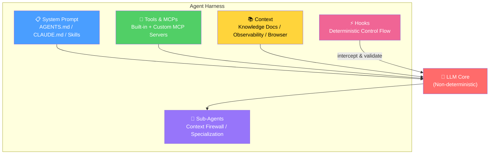

> **Model**: openai/gpt-5.4  
> **Generated**: 2026-04-01  
> **Book**: Claude Code VS OpenCode: Architecture, Design and The Road Ahead  
> **Chapter**: 20 — Context Engineering  
> **Token Usage**: ~6,300 input + ~1,700 output

# 20.1 From Prompt to Context Engineering

For a while, “prompt engineering” was the dominant phrase for practical LLM work. That made sense in the early era, when the most visible leverage came from phrasing instructions well. If you asked clearly, specified format, and added a few examples, performance improved. But coding agents exposed the limits of that framing. A serious agent does not operate on one static prompt. It operates on a continuously changing token state composed of system instructions, tool schemas, user requests, notes, retrieved files, prior tool outputs, memory, summaries, and hidden runtime scaffolding. Once that becomes clear, the center of gravity shifts. The real discipline is no longer prompt engineering. It is **context engineering**.

Prompt engineering is about writing instructions. Context engineering is about curating the entire state the model sees at the moment of action. That difference is more than semantic. It changes what builders optimize.

Under the prompt-engineering mindset, teams ask questions like: what wording works best, how many examples should we include, how should we phrase the role, what sentence makes the model more careful? These questions still matter, but they are only one slice of the real problem.

Under the context-engineering mindset, teams ask different questions: what should be present right now, what should be omitted, what should be summarized, what should be retrieved on demand, what belongs in persistent memory, what belongs in transient working state, how should tool outputs be shaped, how do we recover from overflow, and how do we keep context from rotting over long sessions?

That is a much larger systems problem.

Coding agents force this transition because their failures are rarely caused by bad instruction wording alone. More often they fail because the active context is wrong. They are looking at the wrong files, carrying stale assumptions, overloaded with irrelevant tool output, missing one critical repository rule, or burdened by a transcript that has become too long and noisy. In other words, the issue is not usually “the prompt could have been phrased better.” The issue is “the model is standing in the wrong informational environment.”

This is why context engineering should be understood as **token-state curation**. Every token present in the model input competes for attention. Some tokens sharpen action. Some dilute it. Some are globally important. Others are locally relevant only for one step. Some should remain persistent. Others should be compacted away as soon as they have served their purpose. Designing this flow is now one of the primary architecture jobs in agent systems.

OpenCode points toward this shift by treating sessions, messages, compaction, and instruction layering as formal architectural concerns rather than incidental prompt plumbing. OMO pushes further by dynamically injecting rules, continuation state, and task-scoped context through hooks and orchestration logic. Claude Code productizes the same insight through memory systems, automatic compaction, and explicit differentiation between persistent instructions and ephemeral working state. The vocabulary differs, but the conceptual move is the same: the problem is not one prompt. It is one evolving context state.

There are several practical consequences.

First, the best system prompt is often smaller than people expect. If too much operational detail is stored there, the prompt becomes bloated and brittle. High-altitude principles belong in the system prompt. Time-sensitive, task-local, or retrievable detail belongs elsewhere.

Second, retrieval becomes central. Instead of pinning every possible relevant fact into the prompt, the agent should pull in repository rules, prior decisions, docs, examples, and file slices when needed. This keeps context smaller and more relevant.

Third, summaries become an engineering artifact, not just a convenience. A good compact summary of completed work, remaining uncertainties, and current hypotheses often outperforms replaying a long raw transcript.

Fourth, output shaping matters. Tool outputs are part of context. If tools dump noisy or poorly structured data, the context degrades quickly even when retrieval is correct.

Fifth, memory must be stratified. Not everything deserves the same persistence. Stable user preferences, project conventions, and long-lived repository facts belong in durable memory. Temporary observations, one-off experiments, and transient hypotheses belong in short-lived working context.

The shift from prompt to context engineering also changes evaluation. Instead of only comparing prompt variants, teams should compare context policies. What happens if we inject fewer files? What happens if we summarize tool outputs after each phase? What happens if memory is separated into stable rules and ephemeral notes? What happens if delegation occurs earlier, reducing local context load? These design choices often matter more than small wording tweaks.

There is also a philosophical lesson here. Prompt engineering implicitly imagines the model as a very smart reader of a carefully written instruction sheet. Context engineering imagines the model as a component operating inside a larger information architecture. That second framing is much closer to reality for serious coding agents. It acknowledges that the model’s behavior depends not just on what it is told, but on what information is nearby, what information is absent, what structure surrounds it, and how the surrounding system edits its view over time.

This is why future progress in coding agents will not come only from larger models or better prompts. It will come from better control over what the model sees, when it sees it, and in what form. That is context engineering in its clearest form.

Once you understand that, many best practices fall into place. Minimal system prompts. Just-in-time retrieval. Compaction pipelines. Structured notes. Long-term memory layers. Delegation for context isolation. Overflow recovery. None of these are separate tricks. They are all parts of one discipline: managing token state as carefully as software engineers manage CPU, memory, and network resources.

Prompt engineering taught the industry how to speak to models. Context engineering teaches it how to build environments in which models can think well. For coding agents, that is the more important frontier.

## The Full Picture: Prompt Engineering → Context Engineering → Harness Engineering

> **Appendix Addendum**: generated by openai/gpt-5.4  
> **Token Usage for this added section**: ~3,500 tokens

The transition from prompt engineering to context engineering is already a major conceptual upgrade. But it is no longer the final frame. A third layer has emerged above both: **Harness Engineering**. If prompt engineering asks how to phrase instructions, and context engineering asks what information the model should see, harness engineering asks the deeper systems question: **what environment should we build so that many mistakes become impossible, unlikely, or cheaply recoverable?**

This is why the three terms should be understood as an evolution ladder rather than competing slogans.

| Paradigm | Core Question | Time Scale | Determinism |
|---|---|---|---|
| Prompt Engineering | “How do I phrase this?” | Per-prompt | Low |
| Context Engineering | “What info does the model see?” | Per-session | Medium |
| Harness Engineering | “What environment prevents mistakes?” | Per-project | High |

Prompt engineering operates at the most local layer. It tunes wording, style, examples, and instruction shape for a given turn or template. Context engineering moves up one level. It manages the token-state seen by the model across a session: retrieval, summaries, memory, compaction, tool output shaping, and delegation boundaries. Harness engineering moves up another level again. It treats the agent runtime itself as the design object: system prompts, tools, MCP servers, hooks, sub-agent topologies, validators, permissions, memory rules, and feedback loops.

### Why Harness Engineering Subsumes Context Engineering

Harness engineering does not replace context engineering. It **subsumes** it. Context is one of the dimensions of the harness, but not the whole harness. A model can receive the perfect context and still fail if the tool contracts are weak, permissions are blunt, post-edit verification is absent, or sub-agent isolation is missing. Conversely, a strong harness can often compensate for imperfect context by validating actions, narrowing options, shaping feedback, and forcing self-correction.

This is precisely why the field has moved upward in abstraction. Once teams realized that “the prompt” was too narrow, they adopted context engineering. Once they realized that “the context” was still too narrow, they began describing the broader runtime as a harness.

### The Four Harness Dimensions — Plus Hooks

One useful formulation, associated with **Viv Trivedy**, breaks the harness into four dimensions:

1. **System Prompt** — AGENTS.md, CLAUDE.md, skill instructions, policy layers, and runtime behavioral contracts.
2. **Tools / MCPs** — built-in tools, custom MCP servers, shell wrappers, repository-specific commands, validators, and operational interfaces.
3. **Context** — knowledge documents, retrieved file slices, observability data, browser state, memory layers, summaries, and session compaction.
4. **Sub-agents** — specialization, context firewalling, parallel execution, role separation, and task decomposition.

To this, a fifth item is often added by practitioners such as **HumanLayer**: **Hooks**. Hooks are event-driven control points that inject deterministic logic into an otherwise probabilistic workflow. They let the system react at session start, before or after tool execution, during compaction, after sampling, or on file changes. Hooks matter because they turn architecture into control flow.

### Three Quotes That Define the Paradigm

Three public statements help capture the shift.

From **Mitchell Hashimoto** on February 5, 2026: *“anytime you find an agent makes a mistake, you take the time to engineer a solution such that the agent never makes that mistake again.”* This is the operational ethic of harness engineering: repeated failures should be converted into durable constraints.

From **OpenAI** on February 11, 2026: a team reportedly built a **million-line product with 0 hand-written code** using harness engineering. Whether one interprets that literally or as an emphasis statement, the implication is unmistakable: with enough runtime structure, verification, and recovery, large-scale software generation becomes feasible as a systems problem.

From **HumanLayer**: the key addition is that hooks provide **event-driven deterministic control flow** around the model. This matters because it clarifies that reliability is not only about what the model knows, but also about when the surrounding system intervenes.

### Mapping the Harness Dimensions Across OpenCode, OMO, and Claude Code

The most useful way to compare the three systems is to map them across these dimensions.

| Harness Dimension | OpenCode | OMO | Claude Code |
|---|---|---|---|
| System Prompt | instructions in config, AGENTS.md | dynamic-agent-prompt-builder, 41 hooks inject context | CLAUDE.md, 4-type memory, managed settings |
| Tools | ~22 tools, Zod schema | 26 tools + skill-embedded MCPs | 61 tools, ML permission classifier |
| Context | session compaction, instruction management | preemptive compaction, wisdom accumulation, rules injection | 5-layer compaction, memory system |
| Sub-agents | 4 built-in agents, task tool | 11 agents, Atlas orchestrator, background spawner | AgentTool, TaskTools, DreamTask, Coordinator |
| Hooks | 5 plugin hook types | 41 hooks on 5 tiers | 5 hook types (session/compact/sampling/file) |

This table is compact, but the implications are deep.

#### 1. System Prompt Layer

In **OpenCode**, the system-prompt layer is relatively open and modular. Instructions can be assembled through configuration and project files such as AGENTS.md. This makes it attractive for teams that want transparency and control, but it also means some burden falls on the operator to design clean prompt architecture.

In **OMO**, the prompt layer becomes more engineered. The `dynamic-agent-prompt-builder` assembles tailored prompts for different agents, while hooks inject additional context or rules at runtime. The result is not just a larger prompt, but a more conditional and operational one. Prompt construction becomes part of orchestration.

In **Claude Code**, the prompt layer is more managed. **CLAUDE.md**, multi-type memory, and product-level settings form a curated instruction architecture. The user gets less raw flexibility than in fully open systems, but more vertical integration.

#### 2. Tools and MCPs

**OpenCode** ships with a compact but serious tool surface—roughly twenty-plus tools, strongly schema-defined, with emphasis on composability. This supports the open-host model.

**OMO** extends the host with more tools and, crucially, with **skill-embedded MCPs**. This is a major harness-engineering move because it lets capability bundles travel together: not just instructions, but instructions plus operational interfaces.

**Claude Code** appears to expose the largest direct tool inventory among the three, along with an **ML permission classifier** that reduces human interruption. This is a classic example of harness sophistication: not merely adding tools, but adding a control system that decides when the tools can act.

#### 3. Context Layer

**OpenCode** already treats session compaction and instruction management as architectural concerns, which is why it naturally fits the context-engineering paradigm.

**OMO** pushes beyond this into proactive orchestration: **preemptive compaction**, **wisdom accumulation**, and **rules injection** all indicate that context is being actively managed, not merely stored. This is an important bridge from context engineering into full harness engineering.

**Claude Code** productizes context management at a high maturity level through layered memory and sophisticated compaction strategies. Its context system is not just a technical implementation detail; it is a user-facing behavior model.

#### 4. Sub-agents

Sub-agents are where harness design becomes visibly architectural.

**OpenCode** includes built-in agents and a task mechanism, enough to support decomposition and specialization.

**OMO** treats sub-agents as a first-class orchestration layer: eleven agents, an **Atlas** orchestrator, and background spawning. This is where the **context firewall** principle becomes concrete. Different roles can work with narrower views and better specialization.

**Claude Code** uses a different vocabulary—**AgentTool**, **TaskTools**, **DreamTask**, **Coordinator**—but the same underlying idea appears: isolate work, manage parallelism, and offload subtasks into bounded execution contexts.

#### 5. Hooks

Hooks deserve special attention because they are where deterministic control enters the loop.

**OpenCode** provides five plugin hook types. This already gives builders meaningful interception points.

**OMO** turns those base points into a much richer control fabric with **41 hooks across 5 tiers**. This is an unusually clear example of harness engineering in practice: the host runtime is being instrumented so that policy, context mutation, validation, and workflow guidance can happen at many points in the lifecycle.

**Claude Code** exposes a smaller but important set of hook types around sessions, compaction, sampling, and files. The surface is more controlled, but it reflects the same architectural principle.

### The Key Insight: OMO as HaaS in Practice

The most important comparative insight may be this: **OMO is essentially a pre-built harness that turns OpenCode into a highly engineered agent runtime.** In other words, it is one of the closest practical expressions of **Harness as a Service**.

Why does that matter? Because many teams do not fail to build agents because they lack model access. They fail because harness engineering is difficult. It requires good defaults, many small control points, a library of patterns, and the discipline to turn every recurring failure into a reusable mechanism. OMO lowers that barrier by shipping a large amount of harness intelligence in advance.

Claude Code reaches a similar destination through vertical integration. OpenCode provides the base host for custom harness construction. OMO occupies the middle ground: it packages harness sophistication on top of an open host.

### From Session-Level Optimization to Project-Level Reliability

The ladder from prompt engineering to context engineering to harness engineering also corresponds to a shift in time horizon.

- Prompt engineering optimizes **a request**.
- Context engineering optimizes **a session**.
- Harness engineering optimizes **a project runtime**.

This is why determinism rises as we move upward. Prompt phrasing is relatively soft. Context policy is stronger but still dynamic. Harness design introduces durable project-level structure: validators, hooks, permissions, skills, sub-agent workflows, and knowledge files. These mechanisms do not merely advise the model. They shape the space of possible behavior.

### The Design Consequence

For builders, the practical lesson is straightforward. If an agent fails, the right response is not only to rewrite the prompt. It is to ask at which layer the fix belongs.

- If the wording is ambiguous, fix the prompt.
- If the model saw the wrong information, fix the context policy.
- If the model should never have been allowed to make that class of mistake in the first place, fix the harness.

That final category is where the field is heading. Prompt engineering taught us to write better instructions. Context engineering taught us to curate token state. Harness engineering teaches us to build environments where reliability compounds over time.
