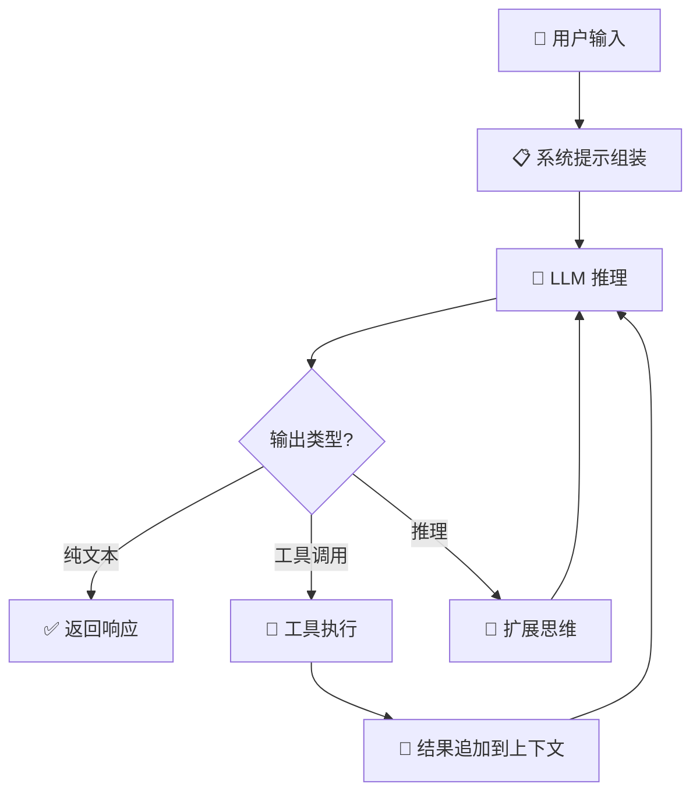

> **模型**: openai/gpt-5.4  
> **生成日期**: 2026-04-01  
> **书名**: Claude Code VS OpenCode：架构、设计与未来  
> **章节**: 第3章 — 核心循环：ReAct范式  
> **Token用量**: 约 18,000 input + 2,400 output  

# 3.1 思考-行动-观察循环

三套系统虽然产品形态不同，但其执行内核都可归结为 ReAct：先 **Reason**，再 **Act**，再根据结果 **Observe**，然后继续下一轮。这里的关键不在于“模型会不会思考”，而在于系统把一次回答拆成一个可中断、可追加、可恢复的循环。用户输入进入系统后，首先会触发 **system prompt assembly**，也就是把默认系统提示、工具清单、权限规则、项目上下文、记忆与附加约束拼成可发送给 LLM 的运行态提示。随后 LLM 开始生成流：可能包含普通文本、reasoning/thinking 片段、以及 tool call。工具执行后，结果不会直接“显示完就结束”，而是会被结构化追加回上下文，成为下一轮推理的观察材料。于是，一个回答实际上是一串小回合，而不是一次性吐完的长文本。



把这个过程抽象后，可以写成如下伪代码：

```text
user_input
   ↓
assemble_system_prompt()
   ↓
while not stop_condition:
    stream = llm.generate(messages, tools, thinking)
    for chunk in stream:
        render_text_or_reasoning(chunk)
        if chunk contains tool_call:
            result = execute_tool(chunk.tool_call)
            append(tool_result_message(result))
            continue loop
    append(assistant_text_message)
    if no tool_call:
        break
return final_response
```

OpenCode 的实现最“教科书化”。`session/processor.ts` 中 `SessionProcessor.create().process()` 以 `while (true)` 驱动主循环，再通过 `LLM.stream(streamInput)` 订阅 `stream.fullStream`。流里被拆成 `reasoning-start`、`reasoning-delta`、`text-delta`、`tool-call`、`tool-result`、`finish-step` 等事件，分别写回 `MessageV2` 的不同 part。也就是说，OpenCode 并不把一次 assistant 输出看成一段字符串，而是看成一组带类型的事件片段。其好处是 UI、持久化、审计、重放都能对齐同一个结构。尤其在 `tool-call` 之后，工具结果进入消息 parts，再由返回值决定是 `continue`、`compact` 还是 `stop`，这正是一个标准 ReAct 状态机。

Claude Code 的写法更工业化。`QueryEngine.ts` 负责回合生命周期与上下文装配，`query.ts` 则承载超长的主循环逻辑。这里最关键的是对 `tool_use` / `tool_result` block 的处理：模型流式产出 `tool_use` 块，系统将其缓存到 `toolUseBlocks`，并用 `ToolUseContext` 维护权限、消息、abort、agent 身份、UI 状态与后续附件注入所需的执行上下文。随后 `runTools()` 或 `StreamingToolExecutor` 执行工具，再把 `tool_result` 重新规范化为下一轮 user-side message。Claude Code 的特点不是“也有 ReAct”，而是把 ReAct 做成了可恢复、可预算、可并发、可 hook 的生产级循环。

OMO 在这一层并没有重写 OpenCode 内核，而是选择“寄生式增强”。它继承 OpenCode 的处理器与消息模型，但通过 `tool.execute.before`、`tool.execute.after`、`chat.message`、`experimental.chat.messages.transform` 等钩子，在循环的关键边界插入自己的逻辑。`tool.execute.before` 可以改写任务委托参数、启动 Ralph Loop；`tool.execute.after` 可以截断输出、注入恢复信息、监控上下文；`experimental.chat.messages.transform` 则在真正发往模型前补充上下文并校验 thinking block。换句话说，OMO 不是换了一个新循环，而是在宿主循环的“关节点”上装了更多齿轮。

这里还要解释一个非标准 CS 术语：**Extended Thinking**。它不是传统教材中的算法术语，而是近两年大模型系统中的工程概念。可把它理解为“模型在正式输出前，系统显式保留一段更长的中间推理轨迹，并允许这段轨迹与工具调用形成连续状态”。它不像编译原理中的 IR，也不像经典 AI 里的显式搜索树；更接近一种“被流式暴露的内部工作记忆”。因此，Extended Thinking 的价值不只是“想得更久”，而是让系统有机会校验 thinking block、在 tool use 前后保持推理连续性，并把原本黑盒的一次生成，改造成可控制的长链条执行。

还要看到一个很容易被忽略的差别：三者虽然都在做 ReAct，但“循环的拥有者”并不相同。OpenCode 的循环主要由 session runtime 持有，因此更像宿主内核；Claude Code 的循环则由 query engine、budget、hooks、tool orchestration 共同持有，因此更像一个分层控制系统；OMO 则把“是否继续”部分外移到 hook 与 continuation 机制，使循环从“单一控制器”演化为“宿主循环 + 外围续接器”的双层结构。对于未来 agent 设计，这意味着一个关键原则：真正可扩展的 ReAct，不应把循环写死在模型调用函数里，而要把推理、工具、上下文追加、停止决策拆成可插拔的边界。

从架构哲学上看，三者共享同一个答案：AI 编码智能体并不是“会回答问题的聊天机器人”，而是“围绕 LLM 建立的循环式执行机”。OpenCode 给出最清晰的最小实现，Claude Code 把它推向产品级稳态，OMO 则证明：只要宿主暴露足够好的 hook，ReAct 循环本身就能成为二次编排的平台。
