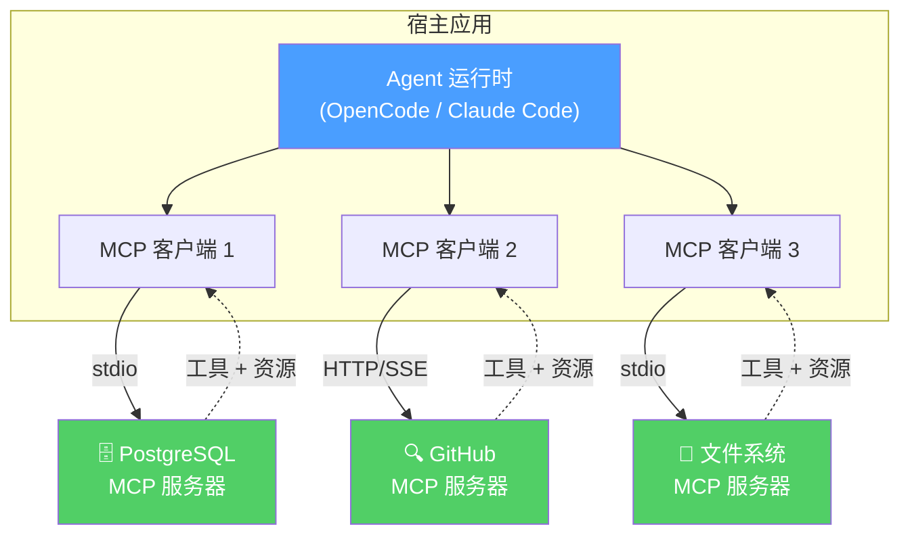

> **模型**: openai/gpt-5.4  
> **生成日期**: 2026-04-01  
> **书名**: Claude Code VS OpenCode：架构、设计与未来  
> **章节**: 第7章 — MCP：AI的USB-C  
> **Token用量**: 约 11,000 input + 2,100 output（估算）

# 7.1 为什么MCP改变了一切

2024 年 11 月，Anthropic 以 MIT license 发布 **MCP（Model Context Protocol）**。表面上看，它只是一个 open standard，用来让 AI 系统连接 tools、data 与 prompts；但从架构史的角度看，它更像是一次接口层的大一统。把 MCP 称作“**AI 的 USB-C**”，并不是一句轻飘飘的类比，而是点中了它真正改变生态的原因：它把原本高度碎片化的“能力接入层”标准化了。

为什么是 USB-C，而不是别的比喻？因为 USB-C 的价值不在于“线”，而在于“统一接口 + 能力协商”。在 USB-C 出现之前，设备厂商经常各做各的接口、充电协议与数据传输方式，导致用户和开发者都要承担兼容成本。AI Agent 世界在 MCP 之前也是如此：每个 host、每个 framework、每个 tool vendor 都可能定义自己的 tool schema、调用格式、认证方式和 transport。结果就是：同样一个搜索服务，要为多个 Agent 产品重复适配；同样一个 Agent runtime，也要为多个外部能力重复接线。

MCP 试图解决的，正是这个“接口碎片化”问题。

它的核心架构可以概括为：

**Host → MCP Client ←→ JSON-RPC 2.0 ←→ MCP Server**

这里的 **Host** 指用户直接使用的 AI 应用或 Agent runtime，比如 Claude Desktop、Cursor、VS Code、Zed、ChatGPT，也包括 OpenCode 这样的 agent shell。Host 内部包含 **MCP Client**，由它来负责协议通信。另一端是 **MCP Server**，它暴露三类核心能力：

- **Tools**：可执行动作，例如搜索、读写数据、调用 API、浏览器操作
- **Resources**：可读取的数据对象，例如文档、配置、记忆、结果文件
- **Prompts**：由 server 提供的可复用 prompt 模板

这三分法非常关键。很多早期系统喜欢把一切都压扁成 tool，但 MCP 更细分：有些东西是“动作”，有些是“数据”，有些是“提示模板”。这种划分让 host 能更清楚地理解能力边界，也让 server 的设计更清晰。例如一个 docs server 既可以暴露“搜索文档”的 tool，也可以暴露“某篇文档内容”的 resource，还可以提供“将 API 迁移步骤整理成说明”的 prompt。

MCP 在消息层通常建立在 **JSON-RPC 2.0** 之上。这里有必要稍微解释一下，因为 **RPC（Remote Procedure Call）** 这个概念虽然在分布式系统课程里出现过，但 **JSON-RPC** 这种具体协议并不是传统 CS 教科书里最常见的重点术语。可以把它理解成：你要调用“远端”的一个函数，但不是直接在本地进程里调用，而是把“方法名、参数、请求 id、返回结果或错误”打包成 JSON 消息发送出去。JSON-RPC 2.0 就是把这套调用约定标准化了。它的好处是：格式统一、容易调试、与具体 transport 解耦。

也正因为如此，MCP 的 transport 可以灵活变化。它常见支持三种路径：

- **stdio**：本地模式。Host 启动一个本地进程，通过 stdin/stdout 与其通信。
- **HTTP + SSE**：远程模式。客户端通过 HTTP 发起请求，通过 **SSE（Server-Sent Events）** 获取流式返回。SSE 是浏览器与后端常见的一种单向流式推送机制，传统教材通常会讲 HTTP 和 WebSocket，但不一定会系统展开 SSE。
- **WebSocket**：Web 场景下常见的双向长连接 transport。

这个 transport flexibility 不是“锦上添花”，而是 MCP 能快速落地的关键。因为 AI 工具的部署环境天然多样：有些能力适合本地进程，有些是远程 SaaS，有些运行在浏览器或 IDE extension 里。如果协议把 transport 写死，生态就会卡住；而 MCP 把 transport 与 capability declaration 分开，host 与 server 才能在不同环境下复用同一套能力语义。

MCP 最经典的价值表达，是所谓的 **N+M advantage**。在没有统一协议时，假设你有 **N 个 Agent framework**，以及 **M 个 tool provider**，那么总共往往需要 **N×M** 个定制集成：每个 host 都要单独接每个工具。标准化之后，情况变成：每个 host 只要实现一次 MCP，每个 tool provider 也只要实现一次 MCP，总代价逼近 **N+M**。这就是标准的网络效应：它不只是“优雅”，更是把生态的边际集成成本从乘法关系降成加法关系。

正因为成本曲线改变了，MCP 才会迅速扩散。到 2026 年，MCP 已经不只是 Anthropic 自家协议。除了 **Claude Desktop** 这个最早的重要宿主，它还被 **Cursor、VS Code、Zed、ChatGPT** 等广泛吸收，同时催生了 **1000+ community servers**。这些 servers 的能力覆盖非常广：GitHub search、web search、browser automation、docs retrieval、database access、design tools、Slack、memory systems、enterprise connectors 等等。真正重要的不是“数量”，而是“形态”——MCP 开始成为“Agent 外部能力”的默认封装方式。

这会带来一个更深的变化：**分工方式改变了**。在 MCP 之前，一个 Agent 产品如果想更强，往往得自己同时承担模型调用层、tool 定义层、外部数据接入层、认证层、错误处理层。也就是说，产品团队既要做 agent runtime，又要做 integration platform。MCP 出现后，这些职责可以拆开：host 专注于 reasoning、UX、permission、orchestration；server 专注于某个领域能力本身。这种分工会极大释放生态活力。

例如，一个搜索公司可以只做 search MCP server；一个 docs 公司可以只做 documentation MCP server；一个 design vendor 可以只做 Figma 或 design system MCP server；而 Agent runtime 则在更上层竞争：谁的 context engineering 更强、tool selection 更稳、权限模型更安全、用户体验更好。换言之，MCP 让 Agent 世界从“封闭的一体化产品竞争”，逐渐转向“模块化生态竞争”。

还有一个容易被忽视但很重要的点：MCP 强迫系统设计者重新整理概念边界。很多 Agent 系统容易把“模型推理”“工具调用”“外部数据访问”“提示模板”“UI 交互”混成一团，最后 runtime 变成大泥球。MCP 把这些层次拆得更干净：Client 负责面向模型的能力调度；Server 负责暴露 capability；JSON-RPC 负责消息框架；transport 负责传输。边界一旦清楚，可测试性、可替换性、安全性和可维护性都会提升。

当然，MCP 不是万能的。它不能自动解决权限问题，不能自动防止危险工具被滥用，也不能消灭超长输出、错误 schema、或者误导性结果。标准只能统一接口，不能替你做产品治理。但这并不影响它的革命性。历史上真正改变生态的标准，往往也不是“解决一切”的标准，而是“解决那个最阻碍生态扩张的接口问题”的标准。HTTP、JSON、OAuth、USB 都是如此，MCP 也是如此。

所以，MCP 改变一切，不是因为它让模型更聪明，而是因为它让 **Agent 能力交换** 这件事第一次有了稳定公共语言。模型会迭代，context window 会继续膨胀，agent orchestration 也会继续演化；但 MCP 提供的是更底层、更持久的东西：一个共享的 capability substrate。对于 AI Coding Agent 来说，这意味着工具接入不再是产品私有技巧，而开始变成整个生态的公共基础设施。这就是它真正改变一切的原因。
