> **Model**: claude-opus-4-6 (anthropic/claude-opus-4-6)
> **Generated**: 2026-04-03
> **Book**: Claude Code VS OpenCode: Architecture, Design and The Road Ahead
> **章节**: 第12章 — 解剖一个13万行代码的插件
> **Token Usage**: ~120,000 input + ~6,800 output

# 12.1 插件入口与启动序列

## 先回答一个最基本的问题：OMO 到底是怎么"进入" OpenCode 的？

很多人第一次听说 Oh-My-OpenCode（以下简称 OMO）时会有一个疑问：一个 13 万行的项目，怎么能"只是一个插件"？它没有 fork OpenCode 的代码吗？

答案是：真的没有。OMO 完全通过 OpenCode 提供的插件接口进入宿主系统。

**用一个比喻来说**：OpenCode 是一栋写字楼，提供了电梯、水电、网络等基础设施。OMO 是一家搬进这栋楼的大公司——它不需要自己盖楼，但它会租下很多层，装修成自己想要的样子，甚至改造了大堂的导视系统。从外面看，这栋楼还是那栋楼；但走进去之后，你会发现整个运营方式都变了。

下面这张图展示了 OMO 和 OpenCode 之间的层次关系：

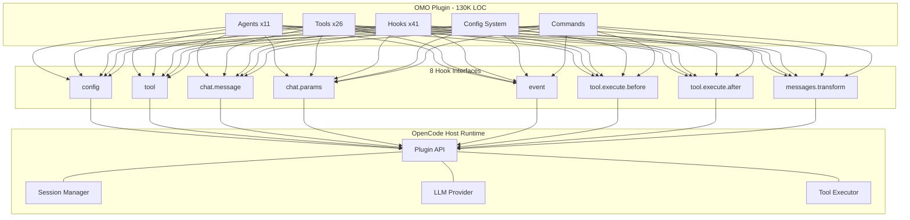

**图示说明**：上层是 OMO 的内部世界（13 万行代码），中层是 8 个标准 hook 接口，下层是 OpenCode 宿主。OMO 的所有能力都通过这 8 个接口"投射"到宿主中。

下面再看一张"不 fork 怎么做到的"的对比图：

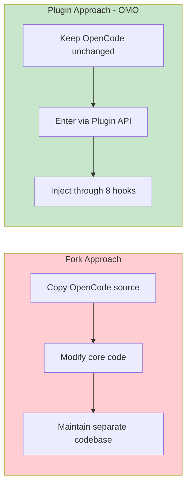

**OMO 选择了插件方式**，这意味着 OpenCode 升级时 OMO 不需要合并代码冲突，只要 8 个 hook 接口不变就行。

---

## 入口文件：一切从 100 行代码开始

> 📁 **文件说明：`src/index.ts`**
> 这是 OMO 插件的总入口文件，只有约 100 行代码。它本身不包含任何业务逻辑（不处理消息、不调用模型），只负责按正确顺序调用各个子系统的初始化函数。你可以把它理解为"装配车间的工序表"——它不生产零件，但它决定了零件的装配顺序。

这个文件导出的是一个异步 `Plugin` 函数。OpenCode 在启动时会调用它，而且调用时机非常早——**早于第一条用户消息被送进 AI 模型**。

下面这张时序图展示了这个关键时机：

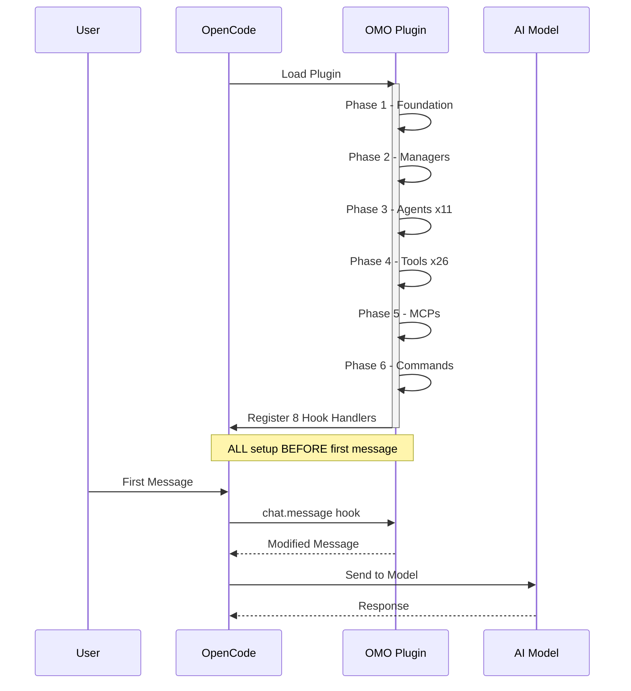

**这意味着什么？** OMO 不是在聊天已经开始之后才做一些修修补补。它是在"开场前"就把整个舞台布置好了：模型配置、工具列表、智能体角色、安全策略……全部在第一轮对话发生之前就位。

---

## 启动序列：像穿衣服一样讲究先后顺序

"Bootstrap sequence"（启动序列）是计算机科学里的常用术语，意思是"一个系统在真正开始工作之前，按顺序完成准备工作的过程"。就像你早上起床——先穿衣服再吃早饭，不能反过来——OMO 的各个组件也有严格的先后顺序，因为后面的组件会依赖前面组件的输出。

OMO 的启动分为 **6 个阶段**：

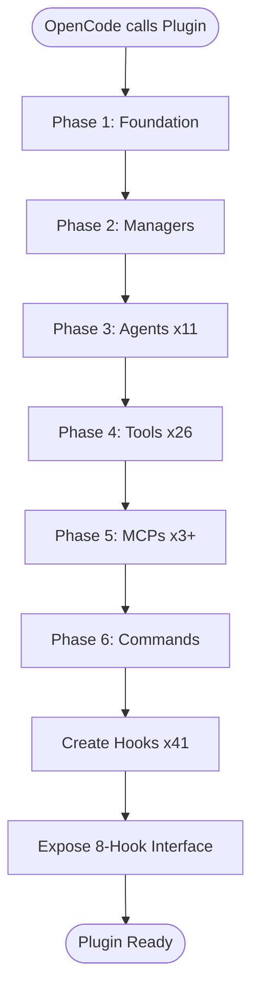

---

### 阶段 1：基础准备——"先检查水电通不通"

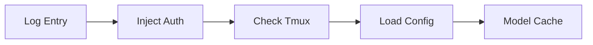

| 步骤 | 做什么 | 为什么 |
|------|--------|--------|
| 记录日志 | 标记插件开始加载 | 方便排查启动问题 |
| `injectServerAuthIntoClient()` | 把服务端认证信息注入客户端 | 确保后续 API 调用的鉴权链路正确 |
| `startTmuxCheck()` | 检查当前终端是否支持 tmux | 决定是否启用可视化多智能体 |
| `loadPluginConfig()` | 读取配置文件 | 决定哪些功能开、哪些关 |
| `createModelCacheState()` | 创建模型能力缓存 | 记住每个模型支持多长上下文 |

> 📁 **文件说明：`src/plugin-config.ts`**
> 配置加载的实现文件。它会读取两个位置的配置：用户主目录下的全局配置和当前项目目录下的项目配置。支持 JSONC 格式（可以写注释的 JSON），使用 Zod 做类型校验。如果某个配置段落损坏，不会导致整个插件崩溃，而是跳过坏掉的部分继续加载。

配置加载完成后，OMO 计算出三个关键的运行时开关：

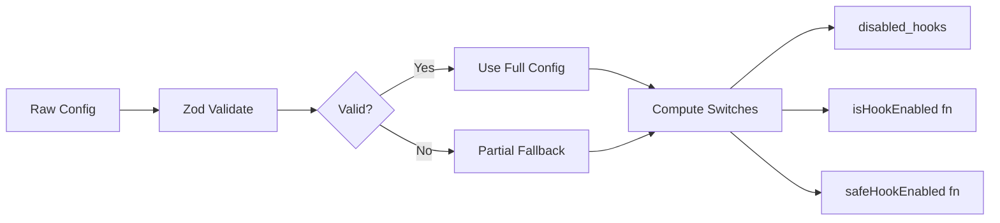

**这意味着什么？** OMO 启动时不是"把所有功能全部打开"。它会先看用户的配置，然后有选择性地决定哪些子系统应该存在。这种方式叫做"策略驱动"——行为由配置决定，而不是硬编码。

---

### 阶段 1.5：两个容易被忽略的小部件

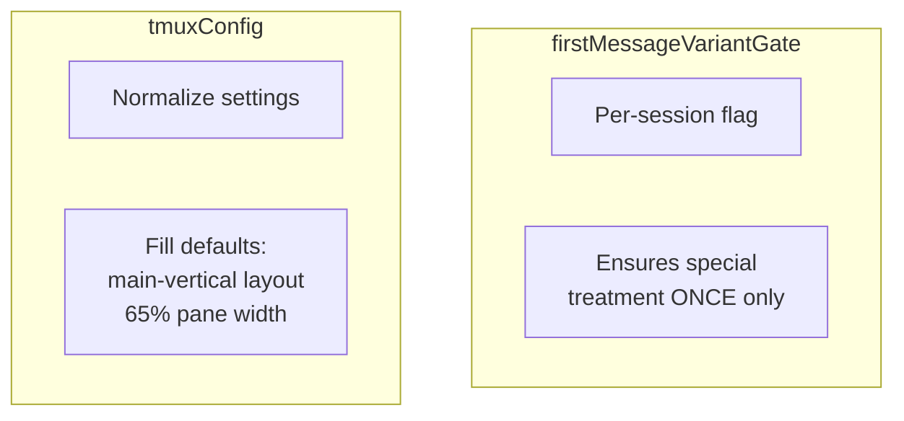

**`firstMessageVariantGate`**（首消息变体门控）：记录每个会话是否已用过"首条消息特殊处理"。OMO 可能在第一轮使用更高推理强度，第二轮起切回正常模式。这个门控确保"特殊处理只执行一次"。

**`tmuxConfig`**（终端分屏配置）：规范化 tmux 配置——即使用户什么都没配，也补上合理默认值。

> 💡 **设计思想**：尽早把"可选输入"转换成"确定状态"。后续代码就不用反复判断"用户有没有配这个"。

---

### 阶段 2：构建管理器——"任命四个部门经理"

> 📁 **文件说明：`src/managers/` 相关文件**
> `createManagers(...)` 创建四个核心管理器——贯穿整个插件生命周期的有状态服务。

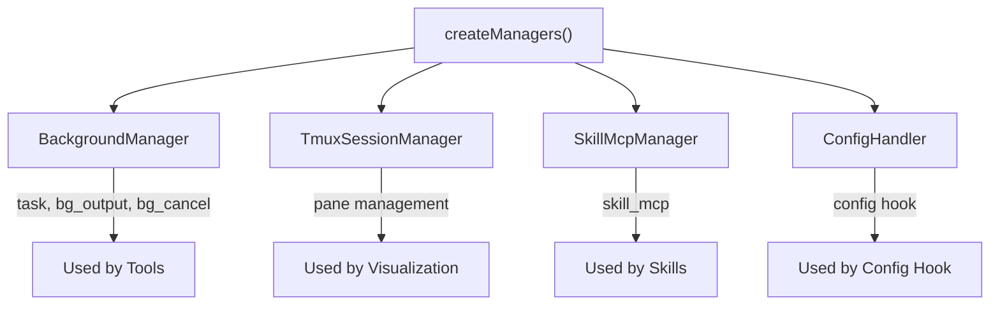

| 管理器 | 职责 | 类比 |
|--------|------|------|
| `BackgroundManager` | 管理后台子智能体的创建、排队、并发控制、结果通知 | 项目经理 |
| `TmuxSessionManager` | 管理终端分屏，让多个智能体的工作可视化 | 监控室 |
| `SkillMcpManager` | 管理技能中内嵌的 MCP 服务器 | 装备管理员 |
| `ConfigHandler` | 注入 agents、MCPs、commands、permissions 到宿主 | 搬家公司 |

---

### 阶段 3-6：组装核心组件

这四个阶段有关键的顺序依赖：

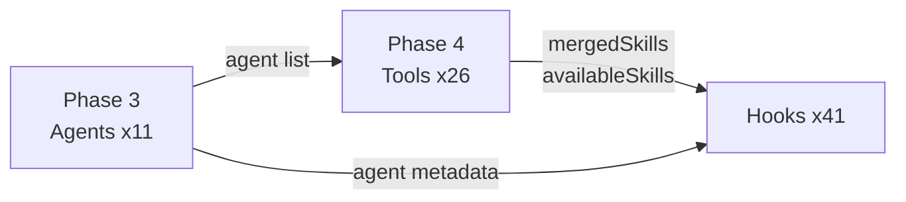

**为什么工具（阶段 4）必须在 Hooks 之前创建？** 因为部分 hooks 需要知道"当前有哪些可用的 skills 和工具类别"，而这些信息是在工具创建阶段算出来的。

> 📁 **文件说明：`src/tools/index.ts`**
> 工具创建的总入口。调用 `createSkillContext()` 获取技能列表，调用 `createToolRegistry()` 注册全部工具，返回 `mergedSkills` 和 `availableSkills` 供后续 hook 使用。

命令合并来自四个来源：

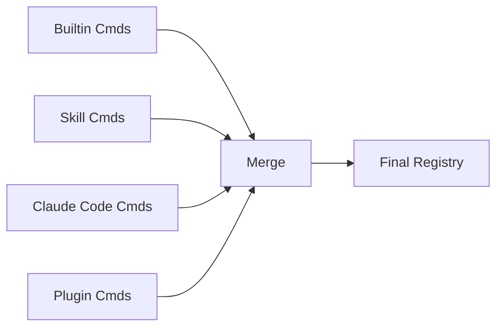

---

## 最后一步：8-hook 握手

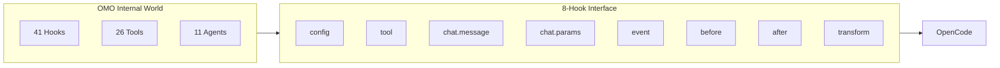

"握手"（handshake）这个词很形象：宿主和插件通过 8 个标准接口接通。OMO 在每个接口背后挂了大量内部逻辑。就像一个公司对外只有 8 个窗口，但每个窗口后面是一整个部门。

还有一个额外接口 `experimental.session.compacting`：

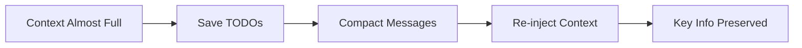

OMO 不仅管消息的"进出"，还管记忆的"存取"。

---

## 入口文件的核心设计理念

`src/index.ts` 是一个 **"克制的装配者"**：

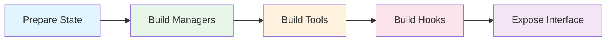

正因为这个启动序列设计得足够干净，OMO 才能在形式上仍然只是一个 plugin，但在效果上却像一个完整的编排层。

---

## 本节要点

- **OMO 不是 fork**：它完全通过 OpenCode 的插件 API 进入宿主，不修改宿主任何源码
- **时机很重要**：OMO 在第一条用户消息到达之前就完成了全部初始化
- **6 阶段启动**：基础准备 → 管理器 → 智能体 → 工具 → MCP → 命令，每个阶段的输出是下个阶段的输入
- **8-hook 握手**：OMO 把内部的 41 个 hooks、26 个工具、11 个智能体，通过 8 个标准接口暴露给 OpenCode
- **策略驱动**：通过配置文件决定启用哪些功能，而不是硬编码全部打开
