> **Model**: claude-opus-4-6 (anthropic/claude-opus-4-6)
> **Generated**: 2026-04-03
> **Book**: Claude Code VS OpenCode: Architecture, Design and The Road Ahead
> **章节**: 第12章 — 解剖一个13万行代码的插件
> **Token Usage**: ~120,000 input + ~7,200 output

# 12.2 八个钩子处理器

## 先看全貌：8 个 hook 到底是什么？

上一节我们知道了 OMO 通过"8-hook 握手"接入 OpenCode。现在的问题是：这 8 个 hook 各自负责什么？

**打个比方**：想象 OpenCode 是一条高速公路，数据（用户消息、工具调用、配置信息）在上面跑。OMO 在这条公路的 8 个关键位置设了检查站。每个检查站可以检查数据、修改数据、或者决定数据能不能继续往下走。

| # | Hook 名称 | 一句话作用 | 类比 | 触发时机 |
|---|-----------|-----------|------|----------|
| 1 | `config` | 注入全部资源到 OpenCode | 搬家公司 | 启动时 |
| 2 | `tool` | 注册 26 个自定义工具 | 往工具箱放工具 | 启动时 |
| 3 | `chat.message` | 消息送进模型前预处理 | 信件分拣室 | 每条消息 |
| 4 | `chat.params` | 调整模型推理参数 | 调空调温度 | 每次推理前 |
| 5 | `event` | 处理会话生命周期事件 | 物业管理中心 | 事件发生时 |
| 6 | `tool.execute.before` | 工具执行前拦截改写 | 安检门 | 每次执行前 |
| 7 | `tool.execute.after` | 工具执行后结果处理 | 质检站 | 每次执行后 |
| 8 | `messages.transform` | 改写送进模型的消息历史 | 剪辑师 | 每次推理前 |

---

## 这 8 个 hook 卡在哪里？

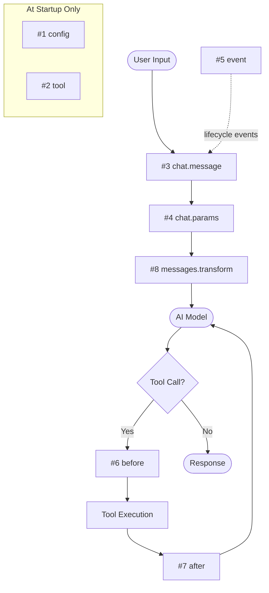

**关键观察**：这 8 个 hook 可以分为三层：

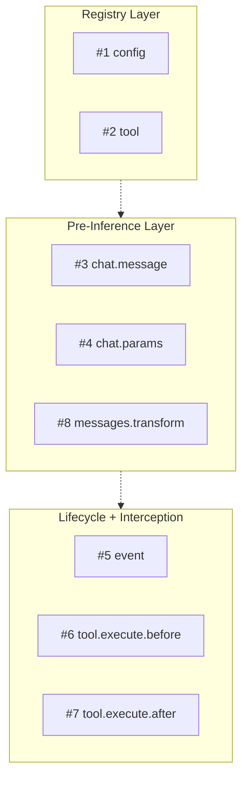

| 层级 | Hooks | 作用 |
|------|-------|------|
| **注册表层** | config, tool | 决定 OpenCode "知道"什么 |
| **推理前塑形层** | chat.message, chat.params, messages.transform | 在模型推理前改写输入 |
| **生命周期与拦截层** | event, tool.execute.before, tool.execute.after | 拦截处理各种运行时事件 |

---

## ① config——"搬家公司"

> 📁 **文件说明：`plugin-handlers/config-handler.ts`**
> 把 OMO 准备好的全部资源注入 OpenCode 配置对象。它就像搬家公司——把 OMO 的东西搬进 OpenCode 的房子里。

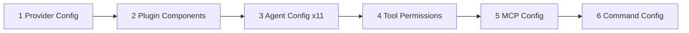

**注入顺序很重要**：Agent 必须先注入，因为后面的工具权限需要知道有哪些 agent。MCP 和 command 放在最后，因为它们不依赖 agent 顺序。

---

## ② tool——"往工具箱里放工具"

> 📁 **文件说明：`plugin/tool-registry.ts`**
> 工具注册表文件。把 26 个工具构造成 OpenCode 能识别的 `ToolDefinition` 格式。

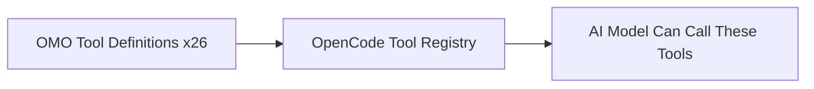

这个 hook 不是"回调"，而是工具目录表本身。OMO 返回 26 个工具定义，OpenCode 加入到模型可调用的列表中。

---

## ③ chat.message——"信件分拣室"

> 📁 **文件说明：`plugin/chat-message.ts`**
> 处理每一条用户消息，是送进模型前最重要的改写点。

这是最复杂的 hook 之一。它做一系列会话级别的智能预处理：

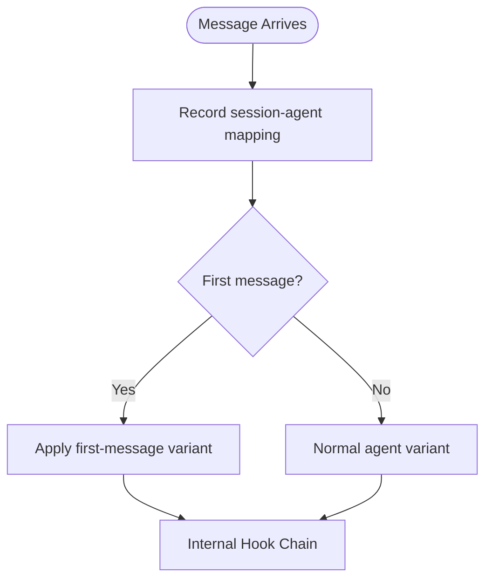

内部 hook 链的详细流程：

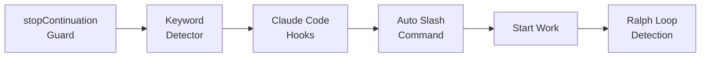

**什么是"首消息变体"？** 第一次点餐时服务员额外推荐特色菜（首条消息用更强推理模式），之后按正常菜单来。`firstMessageVariantGate` 确保"特殊推荐"只发生一次。

---

## ④ chat.params——"调节空调温度"

> 📁 **文件说明：`plugin/chat-params.ts`**
> 调整模型推理参数。把宿主传来的原始参数规范化，然后交给 `anthropicEffort` hook。

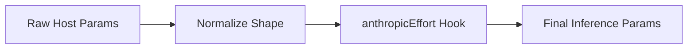

这里的"effort"（努力程度）指的是**模型推理强度**，不是人工工作量。简单任务可以调低（省 token），复杂任务调高（思考更深入）。

---

## ⑤ event——"物业管理中心"

> 📁 **文件说明：`plugin/event.ts`**
> 会话生命周期事件的总调度中心。

**这是内部逻辑最密集的 hook**。一个简单的 `session.idle` 事件会触发一整条处理链：

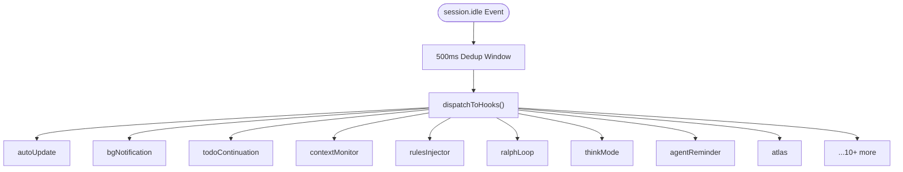

**500ms 去重窗口**：OpenCode 有时短时间内发出多个空闲事件，OMO 通过去重避免重复处理。

---

## ⑥ tool.execute.before——"安检门"

> 📁 **文件说明：`plugin/tool-execute-before.ts`**
> 工具实际执行前的拦截点。做安全检查、参数改写、规则注入。

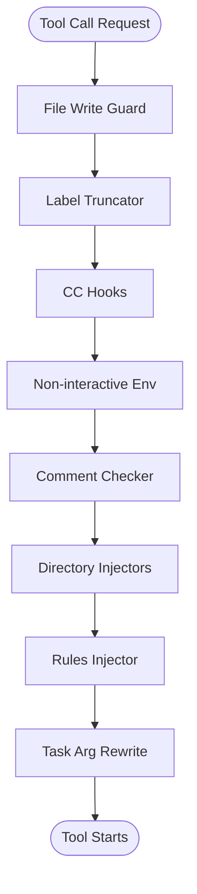

**原则**：先安全防护 → 再规范化 → 再注入规则 → 最后策略改写。

**task 参数改写逻辑**：

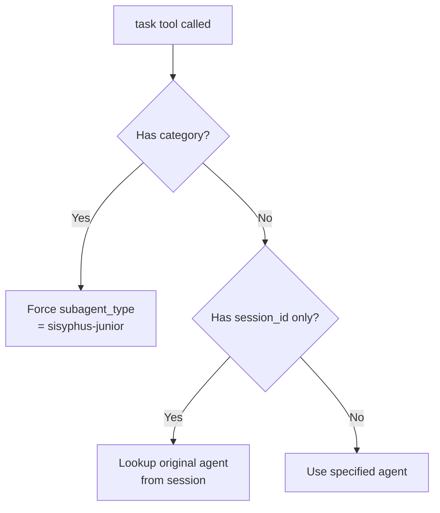

---

## ⑦ tool.execute.after——"质检站"

> 📁 **文件说明：`plugin/tool-execute-after.ts`**
> 工具执行完成后的处理。修正输出、截断过长结果、触发预防性压缩、恢复出错操作。

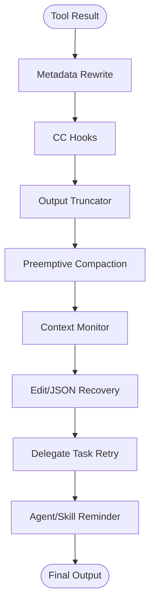

如果 `before` 是"出发前检查装备"，`after` 就是"回来后检查成果"。

---

## ⑧ messages.transform——"剪辑师"

> 📁 **文件说明：`plugin/messages-transform.ts`**
> 在消息历史送进模型前做最后改写。

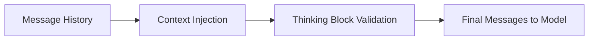

处理顺序：先注入额外上下文，再验证 thinking block 结构合法。

> 💡 **关于 todo 保留**：todo 保留主要发生在 `compactionTodoPreserver` 和 `experimental.session.compacting` 路径上——在记忆压缩时保留，而不是每次消息发送时保留。OMO 把不同的保留策略分配到最合适的生命周期节点。

---

## 三层模型总结

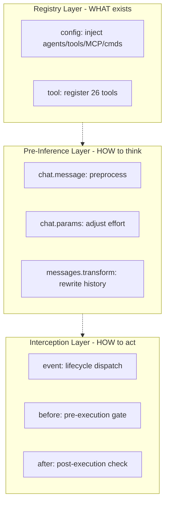

普通插件可能只用到第一层。OMO 三层全覆盖：决定 OpenCode "知道什么"、"怎么思考"、"怎么行动"。8 个 hook 数量不多，但它们正好卡住了宿主运行时的所有咽喉位置。

---

## 本节要点

- **8 个 hook 分三层**：注册表层、推理前塑形层、拦截层
- **config hook 最战略**：决定 OpenCode 最终"看到"什么，注入顺序有严格要求
- **chat.message 最复杂**：不只改消息，还做会话级预处理（变体门控、关键词、循环管理）
- **event 最密集**：一个空闲事件能触发十几个内部子系统
- **before/after 形成夹击**：工具执行前安检，执行后质检
- **核心洞察**：hook 的数量不重要，卡在什么位置才重要
