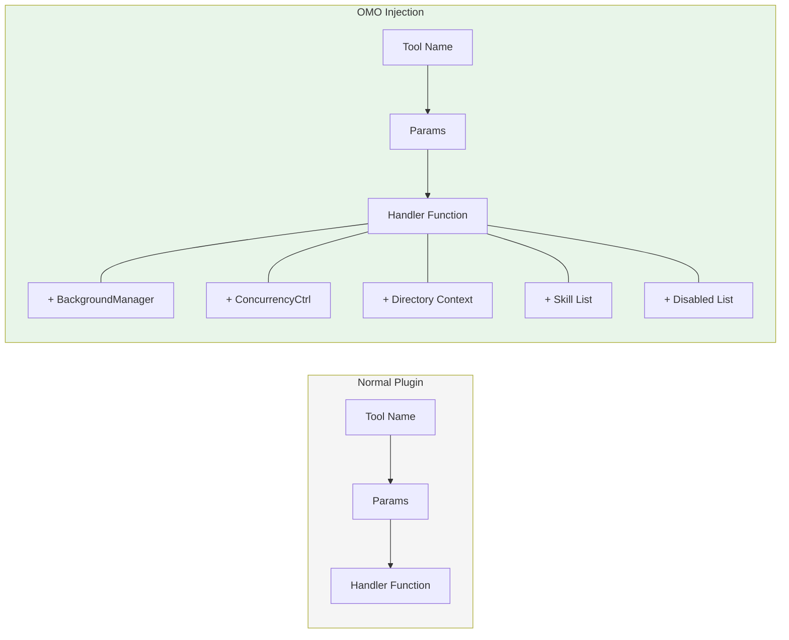
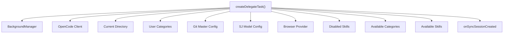
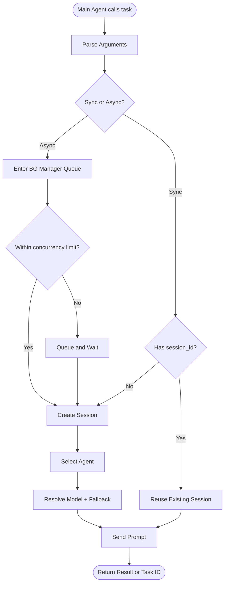
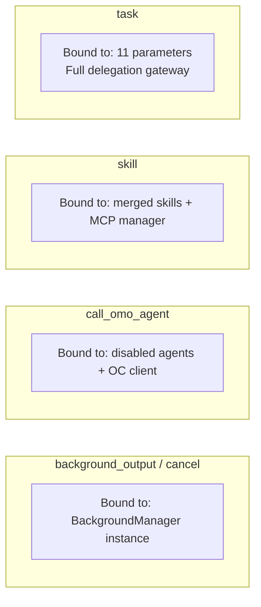
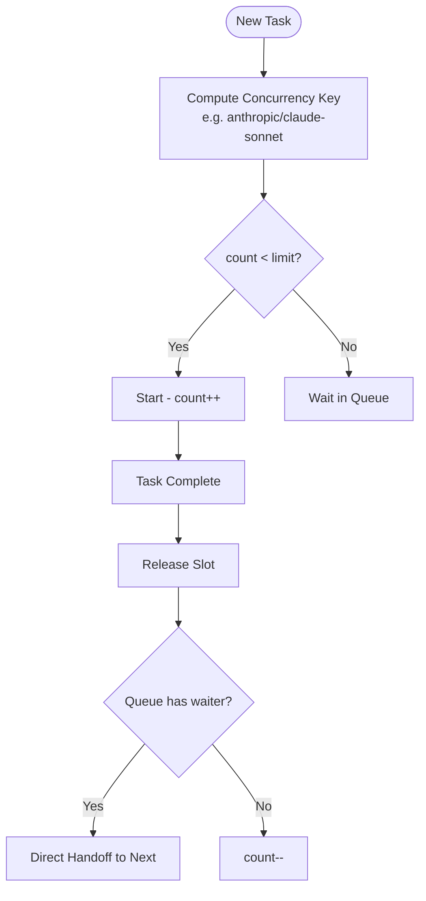
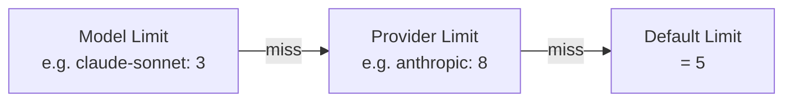
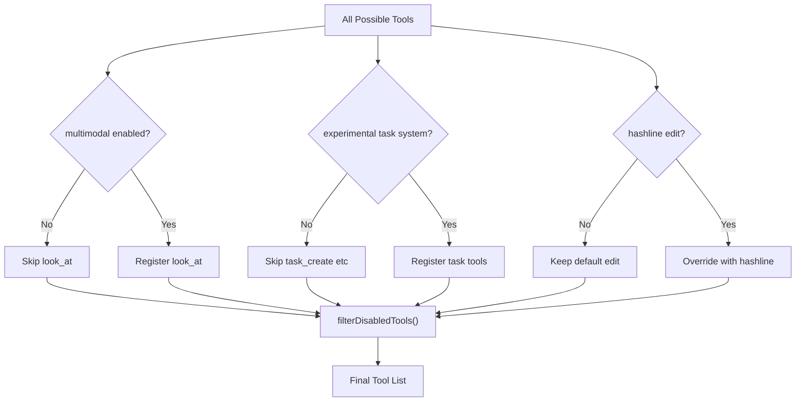
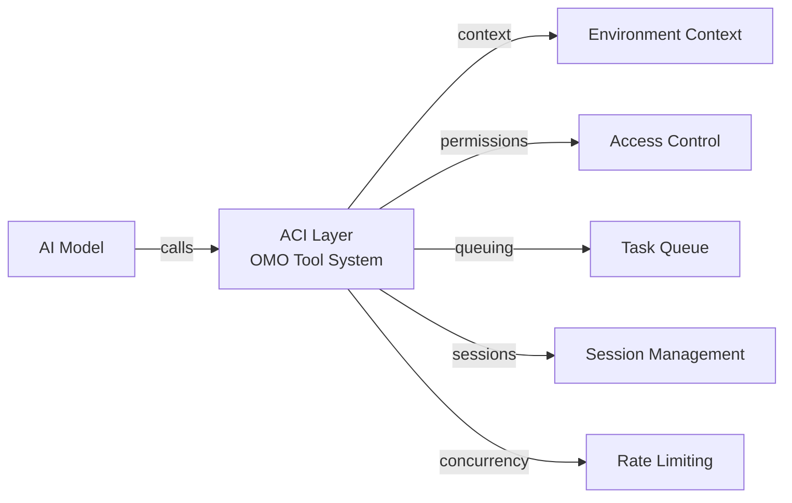

> **Model**: claude-opus-4-6 (anthropic/claude-opus-4-6)
> **Generated**: 2026-04-03
> **Book**: Claude Code VS OpenCode: Architecture, Design and The Road Ahead
> **章节**: 第12章 — 解剖一个13万行代码的插件
> **Token Usage**: ~120,000 input + ~6,500 output

# 12.3 工具注入架构

## "注册"和"注入"有什么区别？

普通插件给宿主加工具，就像往工具箱里丢几把螺丝刀——告诉系统"有个新工具叫 `my_tool`"，仅此而已。

OMO 完全不同。它给每个工具配了使用说明书、安全锁、调度器和专属上下文。

**"注册"**只告诉宿主"有这个工具"。**"注入"**意味着工具被绑定了额外的状态、策略和上下文。

---

## 26 个工具全景图

> 📁 **文件说明：`src/tools/index.ts`**
> 工具创建的总入口。调用各个工具工厂函数，经过特性门控和禁用过滤，返回最终工具列表。

> 📁 **文件说明：`plugin/tool-registry.ts`**
> 把 OMO 工具转换成 OpenCode SDK 能理解的 `ToolDefinition` 格式。

```mermaid
graph TD
    Root["OMO Tools ~26"]

    Root --> LSP["LSP Tools x6"]
    Root --> Search["Search Tools x3"]
    Root --> BG["Background Tools x2"]
    Root --> Delegate["Delegation Tools x3"]
    Root --> Session["Session/Cmd Tools x3-4"]
    Root --> Special["Special Tools"]

    LSP --> L1["goto_definition"]
    LSP --> L2["find_references"]
    LSP --> L3["symbols"]
    LSP --> L4["diagnostics"]
    LSP --> L5["prepare_rename"]
    LSP --> L6["rename"]

    Search --> S1["grep"]
    Search --> S2["glob"]
    Search --> S3["ast_grep"]

    BG --> B1["background_output"]
    BG --> B2["background_cancel"]

    Delegate --> D1["task"]
    Delegate --> D2["call_omo_agent"]
    Delegate --> D3["skill"]

    Session --> SS1["skill_mcp"]
    Session --> SS2["slashcommand"]
    Session --> SS3["interactive_bash"]

    Special --> SP1["look_at - optional"]
    Special --> SP2["session tools"]
    Special --> SP3["task system - experimental"]
```

**为什么要了解这些分类？** OMO 的多智能体编排能力就靠这些工具支撑。没有 `task` 就没有"委派子任务"，没有 `background_output/cancel` 就没有"异步后台执行"。

---

## 最关键的工具：`task`（delegate-task）

> 📁 **文件说明：`src/tools/delegate-task/` 目录**
> 包含 delegate-task 工具的全部实现：任务创建、agent 选择、会话管理、模型解析。

`task` 工具的工厂参数非常多，说明它不是一个简单函数：

完整的执行流程：

**为什么 `task` 这么关键？** OMO 的多智能体编排复用了宿主的 session 机制。一个子任务就是一个新的 OpenCode session，拥有独立消息历史和工具链路。不修改宿主核心即可实现多智能体。

---

## 闭包绑定——每个工具背后的隐藏装备

> 💡 **什么是闭包绑定？** 创建函数时让它"记住"周围的变量。`function makeCounter(start) { let n = start; return () => n++ }`——返回的函数"记住"了 `n`。OMO 让每个工具"记住"创建时的上下文。

| 工具 | 绑定了什么 | 效果 |
|------|-----------|------|
| `background_output/cancel` | BackgroundManager | 直接操作任务管理器 |
| `call_omo_agent` | 禁用 agent 列表 + client | 自动过滤禁用 agent |
| `skill` | 合并技能列表 + MCP manager | 知道哪些 skill 可用 |
| `task` | 11 个参数 | 完整委派网关 |

---

## 并发控制

当主智能体同时委派多个后台任务时，不做限制会打满 API 配额。

> 📁 **文件说明：`src/features/background-agent/concurrency.ts`**
> 按 "model → provider → default" 三层优先级控制并发数量。

**三层限额查找**：

"OMO 默认每个模型/provider 5 个并发后台任务"——这个 5 就是代码里的默认值。

---

## 特性门控：不是所有工具都默认存在

OMO 在注册阶段就根据配置裁剪工具面：

**为什么这样设计？** 工具数量影响模型选择空间。太多工具让模型更容易选错。通过门控确保模型只看到真正有用的工具。

最后一层保险：`filterDisabledTools(allTools, pluginConfig.disabled_tools)`。即使是 OMO 自己的工具也可以通过配置禁用。**整个工具层策略驱动，没有什么"不可关闭"。**

---

## 从架构角度看：工具层 = ACI

OMO 的工具层本质上是 **ACI（Agent-Computer Interface）**——模型通过工具与外部世界交互。

看起来像工具集合，实际更像一个小型执行平台。

---

## 本节要点

- **"注入" ≠ "注册"**：OMO 工具绑定了管理器、上下文、策略
- **26 个工具分 6 类**：LSP、搜索、后台、委派、会话命令、特殊
- **`task` 是核心**：复用 OpenCode session 机制实现子任务委派
- **并发控制三层限额**：model → provider → default(5)
- **特性门控裁剪工具面**：功能没开的工具根本不注册
- **策略驱动**：任何工具都可以通过配置禁用
