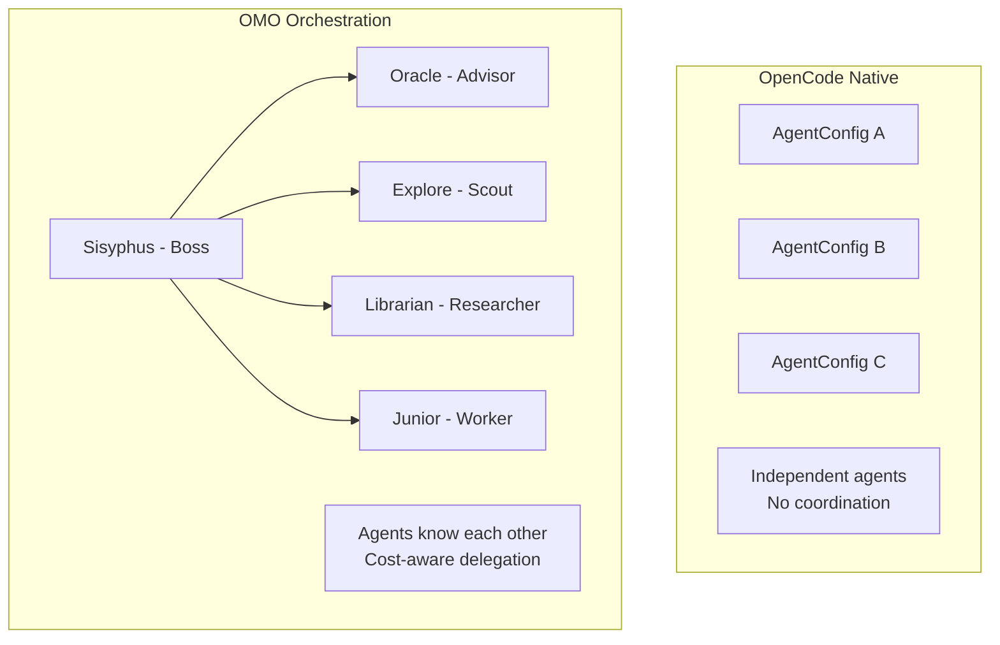
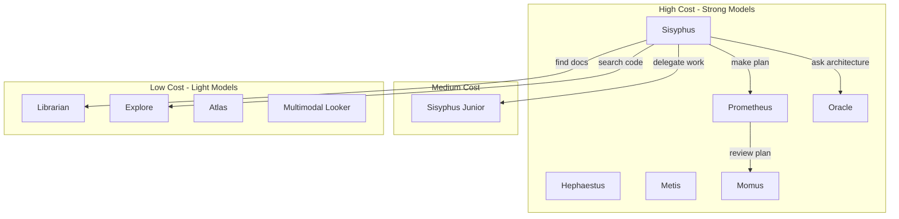
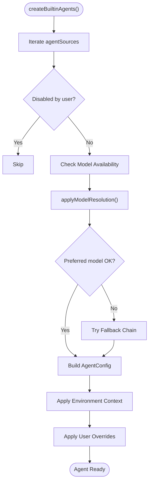
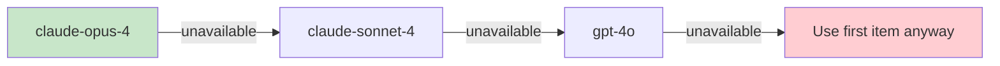
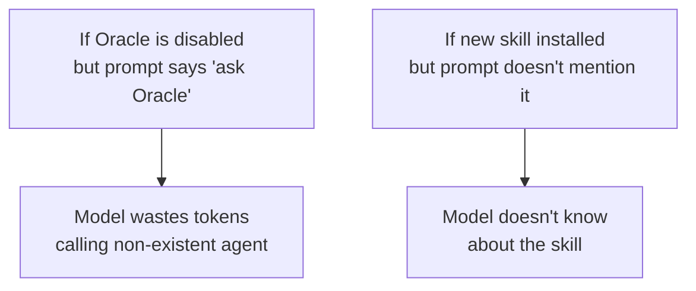
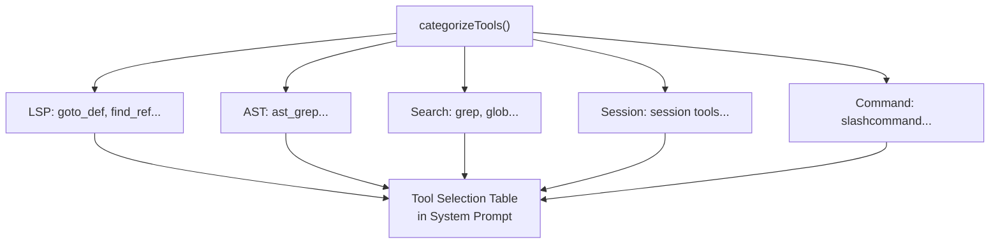
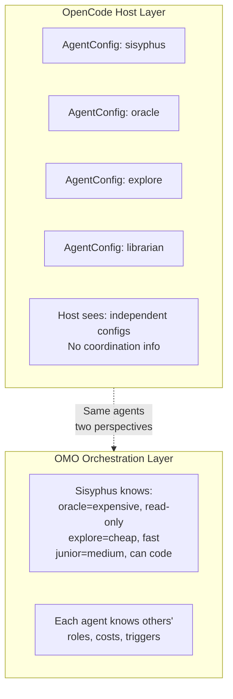
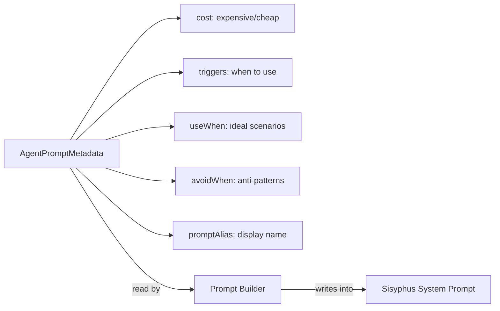

> **Model**: claude-opus-4-6 (anthropic/claude-opus-4-6)
> **Generated**: 2026-04-03
> **Book**: Claude Code VS OpenCode: Architecture, Design and The Road Ahead
> **章节**: 第12章 — 解剖一个13万行代码的插件
> **Token Usage**: ~120,000 input + ~7,000 output

# 12.4 智能体系统实现

## OMO 的"智能体"不是从零造的

OpenCode 本来就支持 `AgentConfig`。OMO 没有推翻这个机制，而是在已有的"员工管理系统"上建了一个更高级的"人力资源部"。

---

## 11 个智能体全家福

| 智能体 | 角色 | 成本 | 典型用途 |
|--------|------|------|----------|
| **Sisyphus** | 主编排者 | 💰💰💰 | 接收请求，拆解任务，协调其他智能体 |
| **Hephaestus** | 主实现者 | 💰💰💰 | 偏实现的主编排者 |
| **Sisyphus Junior** | 执行者 | 💰💰 | 被委派的具体任务 |
| **Prometheus** | 计划者 | 💰💰💰 | 生成详细工作计划 |
| **Oracle** | 顾问 | 💰💰💰 | 架构决策、方案评审 |
| **Librarian** | 外部研究 | 💰 | 查文档、搜 GitHub |
| **Explore** | 内部搜索 | 💰 | 在项目代码库里搜索 |
| **Metis** | 预分析 | 💰💰💰 | 分析需求，识别隐藏意图 |
| **Momus** | 评审员 | 💰💰💰 | 审查计划完整性 |
| **Atlas** | 持续监控 | 💰 | 监控会话，提供上下文提醒 |
| **Multimodal Looker** | 多模态 | 💰 | 分析图片、PDF |

**为什么分成本等级？** 让 CTO 去复印文件太浪费。简单任务用便宜模型，复杂任务才用贵模型。

---

## 智能体创建流程

> 📁 **文件说明：`src/agents/builtin-agents.ts`**
> 所有内建智能体的工厂函数集合。负责检查模型可用性、构建回退链、应用用户覆盖。

### 模型回退链（Fallback Chain）

> 💡 **CS 术语**：Fallback chain = "首选方案不可用时按顺序尝试备选方案"。就像周末想吃火锅——第一选择满了去第二选择。

**一个重要的安全考量**：插件初始化阶段不能调用 OpenCode client API（可能死锁）。所以 OMO 用 provider 缓存和 `fetchAvailableModels()` 提前获取可用模型列表。

---

## 动态 Prompt 组装

普通 agent 的 system prompt 是写死的。OMO 的 prompt 根据当前环境**动态拼装**。

> 📁 **文件说明：`src/agents/dynamic-agent-prompt-builder.ts`**
> 一组"prompt 模块工厂"——根据当前工具、技能、类别、智能体信息动态生成 prompt 段落。

**为什么不写死？**

所以 prompt 必须动态反映当前环境：

> 📁 **文件说明：`src/agents/sisyphus.ts`**
> Sisyphus 的 prompt 由十几个模块拼成：身份定义、Intent Gate、代码库评估、探索策略、实现策略、委派规则、session continuity、todo 纪律、category+skill 协议、硬性约束、反模式清单。

**什么是"工厂模式"？** 不直接手写最终对象，而是通过"制造函数"根据输入动态产生对象。就像不提前做好简历，而是每次根据求职岗位动态填充内容。

**具体例子**：`categorizeTools()` 根据当前注册工具自动分类：

---

## 两层结构：宿主层 vs 编排层

**桥梁：`AgentPromptMetadata`**

---

## 本节要点

- **不造新抽象**：在 OpenCode 原生 AgentConfig 上叠加编排逻辑
- **11 个 agent 分 3 个成本层**：高成本做决策，低成本做搜索
- **模型回退链**：首选不可用自动尝试备选
- **动态 prompt**：根据当前环境实时拼装，确保与实际资源一致
- **两层结构**：宿主看独立 configs，编排层让它们彼此协作
- **元数据是桥梁**：AgentPromptMetadata 让 Sisyphus 知道"该找谁"
