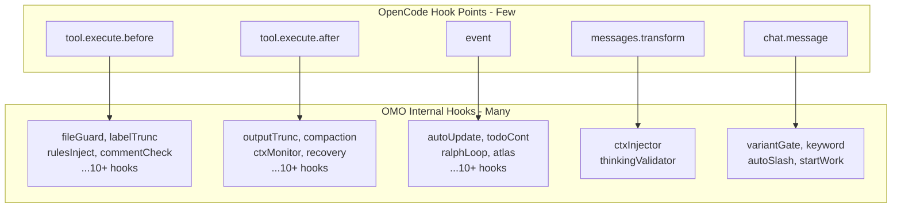
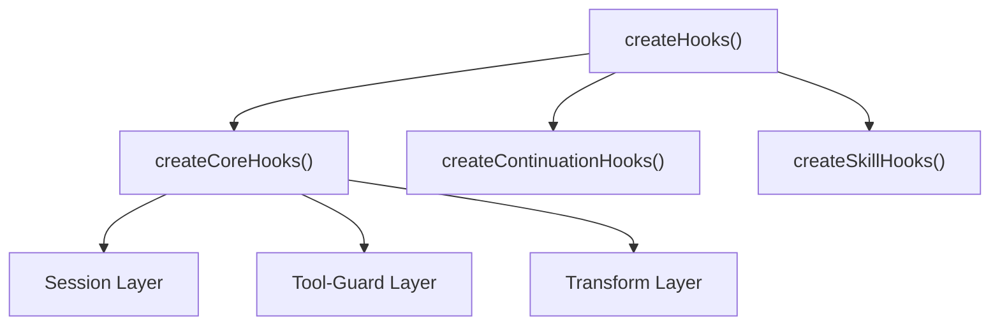
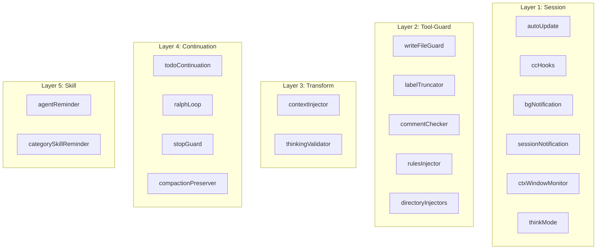
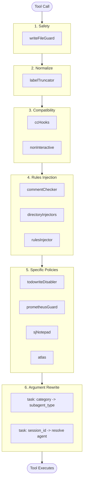
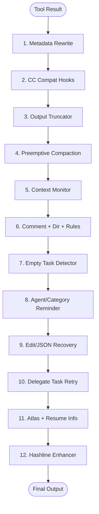
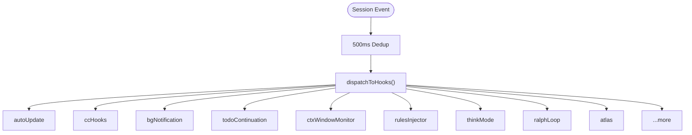
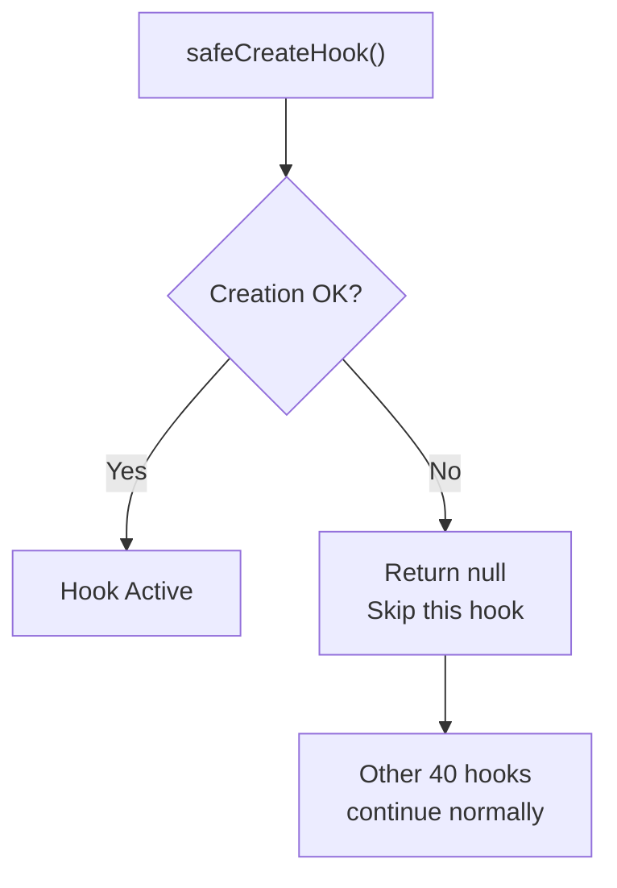
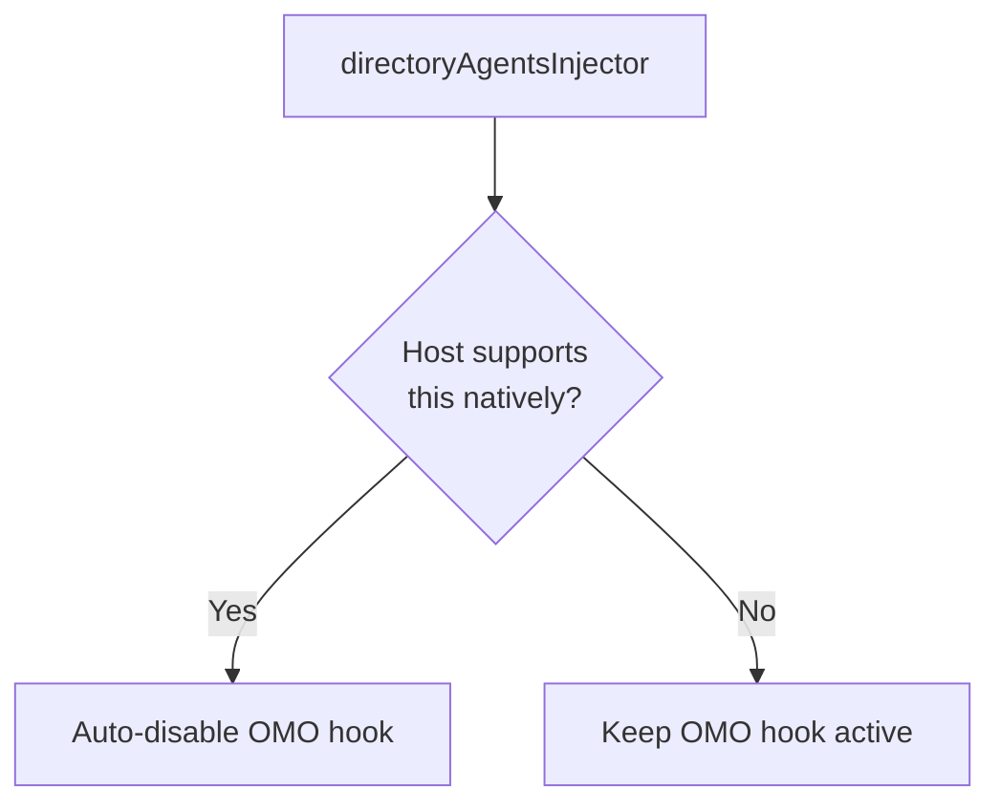
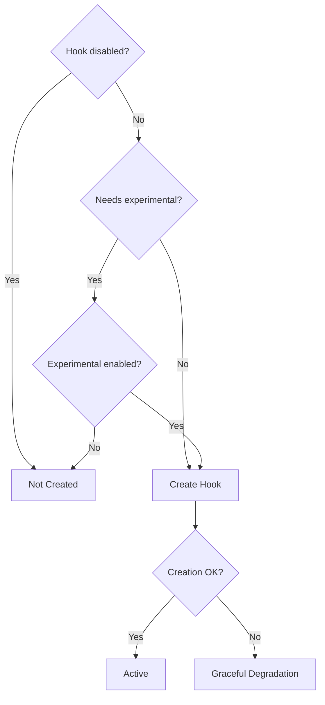
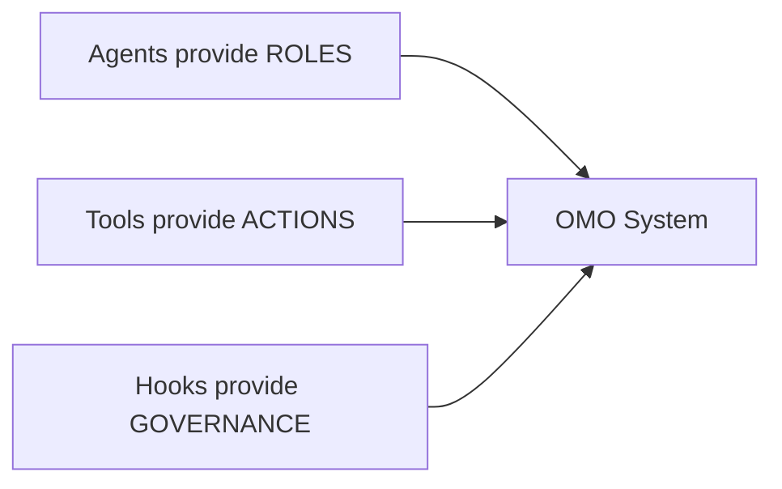

> **Model**: claude-opus-4-6 (anthropic/claude-opus-4-6)
> **Generated**: 2026-04-03
> **Book**: Claude Code VS OpenCode: Architecture, Design and The Road Ahead
> **章节**: 第12章 — 解剖一个13万行代码的插件
> **Token Usage**: ~120,000 input + ~6,800 output

# 12.5 钩子系统深度剖析

## 从 8 到 41：多路复用的秘密

12.2 节介绍了 8 个 hook handler。但 OMO 内部实际有 **41 个 hook**。OpenCode 只给了少数入口，41 个 hook 怎么挂上去？

答案是 **多路复用（Multiplex）**。

> 💡 **什么是多路复用？** 你家一根网线（物理通道）能同时看视频、下载、视频通话（多个逻辑通道）。OMO 一样——少量宿主 hook 入口承载多个内部策略。

---

## 五层分类

> 📁 **文件说明：`src/hooks/create-hooks.ts`**
> Hook 系统的总工厂。合并三大类 hook：core hooks、continuation hooks、skill hooks。

41 个 hook 分五层：

| 层级 | 关注什么 | 典型例子 |
|------|---------|---------|
| Session | 会话生命周期 | 后台通知、上下文报警 |
| Tool-Guard | 工具执行保护 | 防误覆盖、注入规则 |
| Transform | 消息历史改写 | 注入上下文、校验结构 |
| Continuation | 持续执行策略 | todo 自动继续、Ralph Loop |
| Skill | 辅助提醒 | 提醒可用 agent/skill |

---

## 执行顺序就是优先级

**原则**：先安全防护 → 再规范化 → 再注入规则 → 最后具体策略。

### tool.execute.before 流水线

> 📁 **文件说明：`plugin/tool-execute-before.ts`**
> 工具执行前拦截。按优先级依次执行十几个 hook。

### tool.execute.after 流水线

### event hook 分发

---

## 降级策略：一个 hook 坏了不影响全局

**优雅降级**：41 个家电中一个灯泡坏了，换灯泡就好，不用给整栋楼断电。

---

## 版本自适应

宿主升级后原生支持某功能，OMO 自动关闭兼容 hook。

---

## 特性门控

有些 hook 需要同时满足两个条件：

---

## Hook 系统的本质

> 📁 **文件说明：`src/config/schema/hooks.ts`**
> 41 个 hook name 明确列在 schema 中——它们是公开配置面的一部分，用户可以精确控制每一个。

Hook 系统是带执行顺序、降级策略、版本适配和配置开关的**策略路由器**。

---

## 本节要点

- **多路复用**：41 个内部 hook 通过少数宿主入口承载
- **五层结构**：Session → Tool-Guard → Transform → Continuation → Skill
- **顺序 = 优先级**：安全防护最先，具体策略最后
- **优雅降级**：一个 hook 失败不拖垮其他 40 个
- **版本自适应**：宿主升级后自动关闭不需要的兼容 hook
- **可配置到每一个**：用户可精确关闭 41 个 hook 中的任何一个
