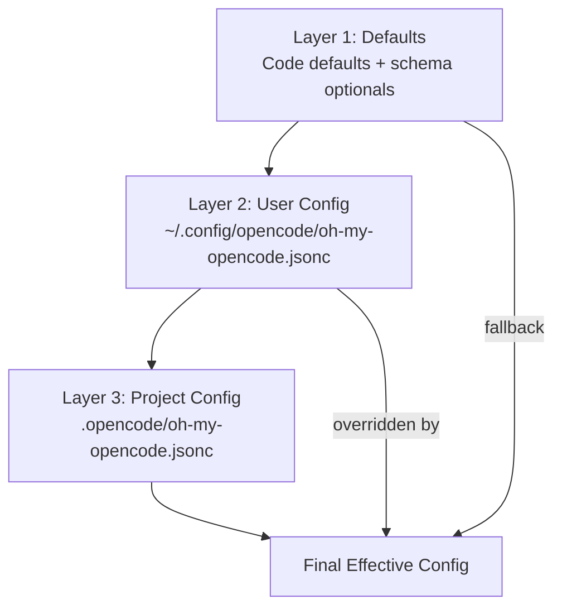
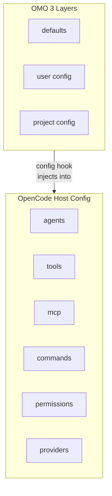
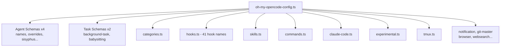
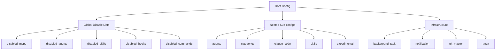
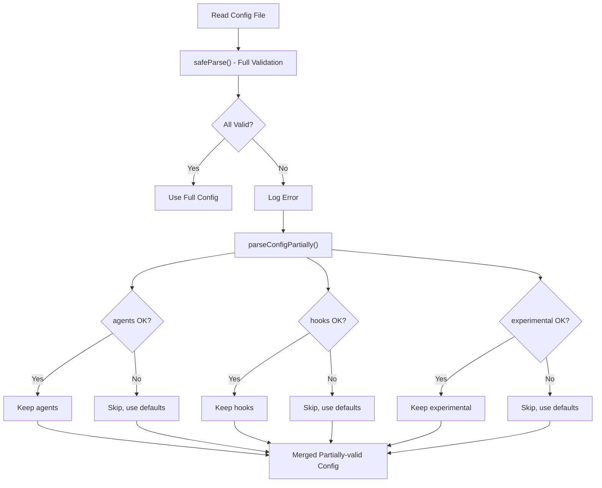
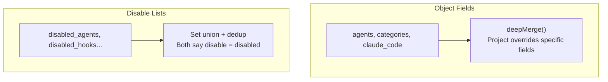
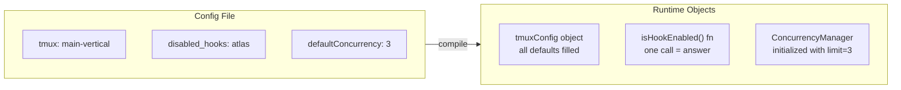
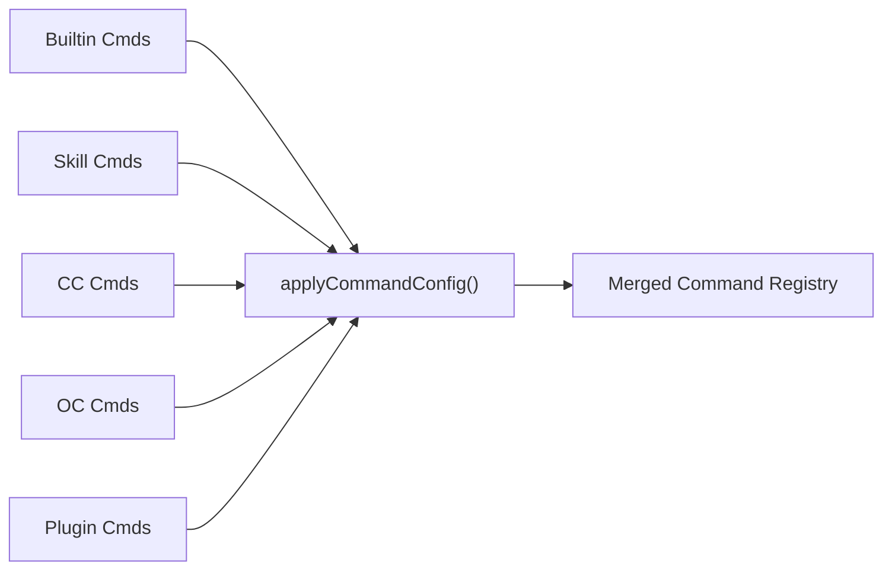

> **Model**: claude-opus-4-6 (anthropic/claude-opus-4-6)
> **Generated**: 2026-04-03
> **Book**: Claude Code VS OpenCode: Architecture, Design and The Road Ahead
> **章节**: 第12章 — 解剖一个13万行代码的插件
> **Token Usage**: ~120,000 input + ~6,200 output

# 12.6 配置分层

## 为什么配置系统重要？

41 个 hook、26 个工具、11 个智能体——如果没有好的配置系统，用户根本无法管理。想象 100 个按钮的遥控器没有说明书、没有分组、按错一个全部失灵。

---

## 三层配置模型

> 📁 **文件说明：`src/plugin-config.ts`**
> 配置加载实现。从多个位置读取、合并、校验，并处理配置损坏。



| 层级 | 类比 | 作用域 |
|------|------|--------|
| 默认值 | 出厂设置 | 兜底 |
| 用户级 | 个人偏好 | 所有项目 |
| 项目级 | 项目特殊要求 | 仅当前项目 |

OMO 三层 + OpenCode 宿主配置 = 共存：



---

## 22 个 Schema 文件

> 📁 **文件说明：`src/config/schema/` 目录**
> 22 个 Zod v4 schema 文件，按责任边界拆分。



总 schema 结构：

> 📁 **文件说明：`src/config/schema/oh-my-opencode-config.ts`**
> 汇总 22 个子域的总 schema。



---

## JSONC 支持

配置支持 JSONC（JSON with Comments）——几十个开关的文件如果不能写注释，几个月后就忘了每个配置是什么意思。

```jsonc
{
  // Disable Atlas (not needed for this project)
  "disabled_agents": ["atlas"],

  // Limit concurrency (API quota limited)
  "background_task": {
    "defaultConcurrency": 3
  }
}
```

**注释就是文档**。OMO 通过 `parseJsonc()` 解析，优先查找 `.jsonc` 后缀。

---

## 部分回退（Partial Fallback）

> 💡 **CS 术语**：不是整个系统退回默认，而是只让出问题的部分降级。



**场景**：experimental 里写了过时的字段名。没有部分回退时，整个配置文件无效，精心配置的 agents、hooks 全部丢失。有了部分回退，只跳过坏掉的 experimental，其他照常。

---

## 合并逻辑



| 字段类型 | 合并方式 | 原因 |
|---------|---------|------|
| 对象字段 | deepMerge | 项目级只覆盖部分字段 |
| 禁用列表 | Set 去重累加 | 两层都说"不要"→最终"不要" |

---

## 从配置到运行策略

配置不是读完就结束。OMO 把"静态配置"**编译**成"运行态策略"：



**横向合并——跨生态资产**：



---

## 本节要点

- **三层优先级**：默认 → 用户级 → 项目级
- **22 个 Schema**：按责任边界拆分，类型严格
- **JSONC**：注释是长期维护的基础设施
- **部分回退**：一个段落坏了不拖垮其他
- **禁用列表累加**：两层都说"不要"→最终"不要"
- **配置到策略**：静态文件被编译成运行态对象
