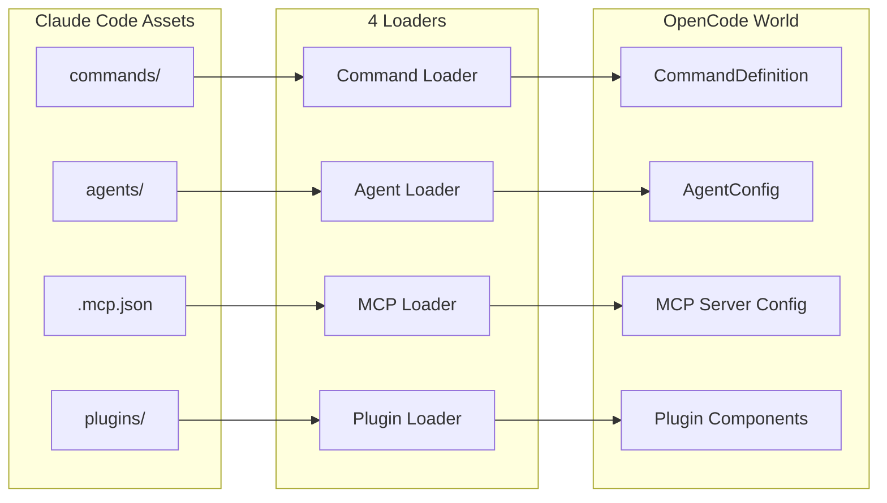
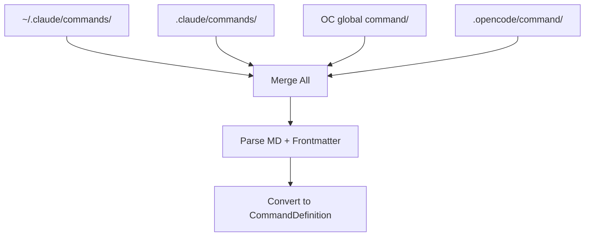
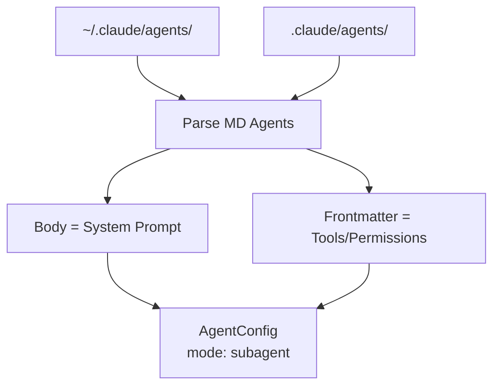
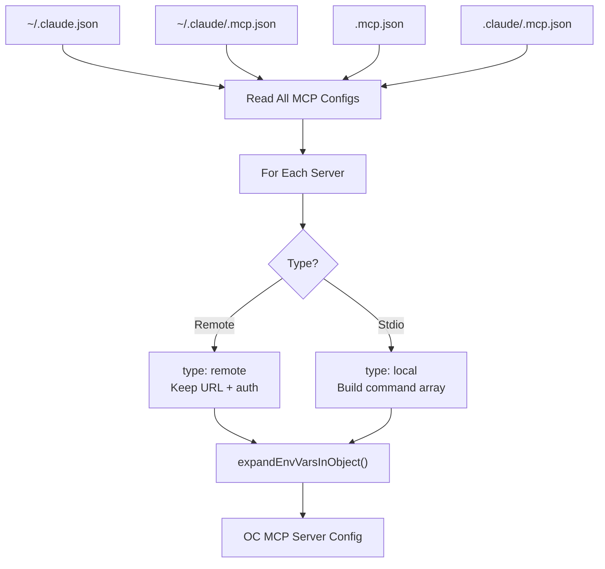
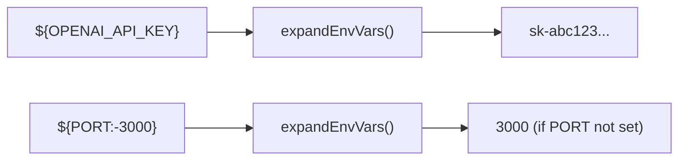
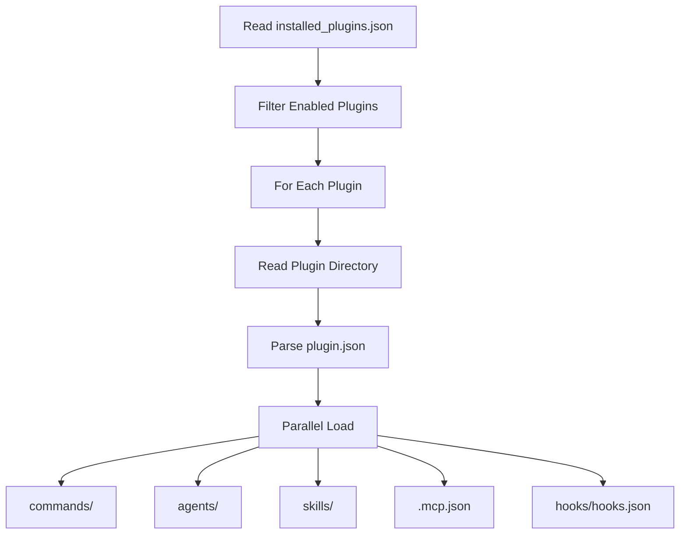
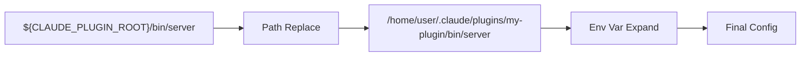
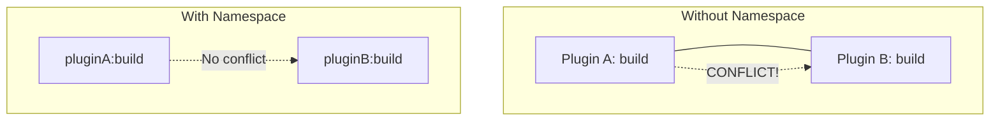
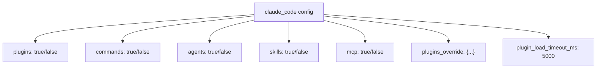
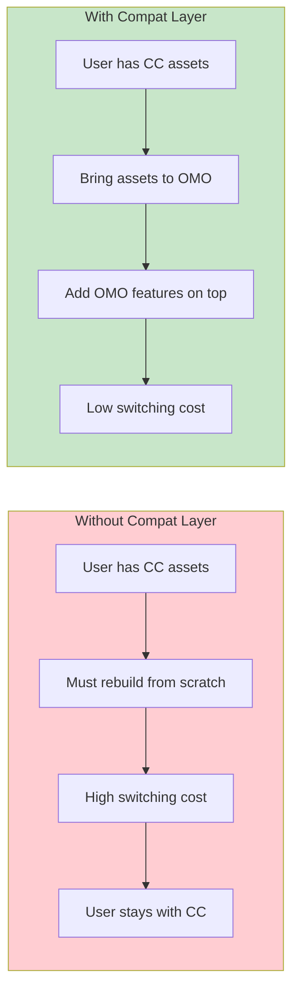

> **Model**: claude-opus-4-6 (anthropic/claude-opus-4-6)
> **Generated**: 2026-04-03
> **Book**: Claude Code VS OpenCode: Architecture, Design and The Road Ahead
> **章节**: 第12章 — 解剖一个13万行代码的插件
> **Token Usage**: ~120,000 input + ~6,500 output

# 12.7 Claude Code 兼容层

## 核心问题：用户的旧资产怎么办？

假设你在 Claude Code 里积累了大量 commands、agents、MCP 配置和插件。想试 OMO 时面临的第一个问题："是不是要从头再来？"

OMO 的回答：**尽量不用。你的旧资产可以直接带过来。**

---

## 1. 命令兼容（Command Loader）

> 📁 **文件说明：`src/features/claude-code-command-loader/loader.ts`**
> 从四个目录加载命令文件，解析 markdown + frontmatter，转换成 OpenCode CommandDefinition。

命令文件格式：Markdown + YAML frontmatter。Loader 把 frontmatter 中的元数据和正文组装成统一模板。

---

## 2. 智能体兼容（Agent Loader）

> 📁 **文件说明：`src/features/claude-code-agent-loader/loader.ts`**
> 从 Claude Code agent 目录读取 markdown 定义，转换成 OpenCode AgentConfig。

> ⚠️ **注意**：当前源码**没有实现 `.opencode/agents/` 的对称 Loader**。兼容层不是每类资产都完全对称。

---

## 3. MCP 兼容（MCP Loader）——最完整的模块

> 📁 **文件说明：`src/features/claude-code-mcp-loader/loader.ts`**
> 从多个位置读取 MCP 配置，支持环境变量展开。

**环境变量展开**：`expandEnvVarsInObject()` 递归处理 `${VAR}` 和 `${VAR:-default}` 语法。

兼容层不只认文件格式，还保留了 Claude Code 生态常见的变量替换习惯。

---

## 4. 插件兼容（Plugin Loader）——最复杂

> 📁 **文件说明：`src/features/claude-code-plugin-loader/discovery.ts`**
> 插件发现。从 `~/.claude/plugins/installed_plugins.json` 读取安装数据库。

> 📁 **文件说明：`src/features/claude-code-plugin-loader/plugin-components-loader.ts`**
> 并行加载每个插件的 commands、skills、agents、MCP、hooks。

**`${CLAUDE_PLUGIN_ROOT}` 路径替换**：

> ⚠️ Claude Code 插件发现路径是 `~/.claude/plugins` 安装数据库，不是 `.opencode/plugins/`。

---

## 命名空间和冲突管理

- 插件资产加 `pluginName:` 前缀
- MCP 保留用户显式禁用状态
- 优先级规则解决同名资产

---

## 精细化控制

每类资产有独立开关：

用户可以说"只要命令和 MCP，不要智能体和插件"。

---

## 为什么做兼容层？——迁移路径策略

> 💡 工具生态的胜出往往不靠"谁功能最强"，而靠"谁迁移最平滑"。

---

## 本节要点

- **四个 Loader**：command、agent、mcp、plugin 各负责一类资产"翻译"
- **环境变量展开**：保留 `${VAR}` 和 `${CLAUDE_PLUGIN_ROOT}` 替换习惯
- **命名空间管理**：插件资产加前缀避免冲突
- **精细化控制**：每类资产有独立开关
- **迁移路径策略**：降低用户切换成本是核心价值
- **并非完全对称**：有些迁移路径更成熟，有些还在演进
