> **Model**: claude-opus-4-6 (anthropic/claude-opus-4-6)
> **Generated**: 2026-04-03
> **Book**: Claude Code VS OpenCode: Architecture, Design and The Road Ahead
> **章节**: 第12章 — 解剖一个13万行代码的插件
> **Token Usage**: ~120,000 input + ~7,500 output

# 12.8 背景智能体生成器与会话管理

## 什么是"背景智能体"？

想象你是项目经理（Sisyphus），手头大任务需要多人并行：让 A 调研技术方案，让 B 搜索代码库，让 C 查文档。他们在后台工作，完成后报告给你。

OMO 的背景智能体就是这个机制。但关键区别：它们**不是轻量协程**，而是**真正的 OpenCode session**。

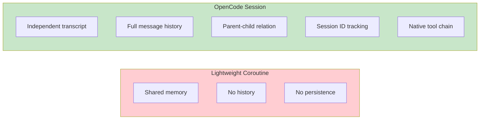

---

## 核心架构

> 📁 **文件说明：`src/features/background-agent/` 目录**
> 包括 `manager.ts`（管理）、`spawner.ts`（启动）、`concurrency.ts`（并发）、`state.ts`（状态）等。

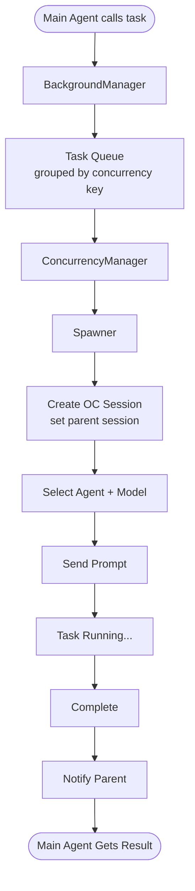

---

## 一个任务的完整旅程

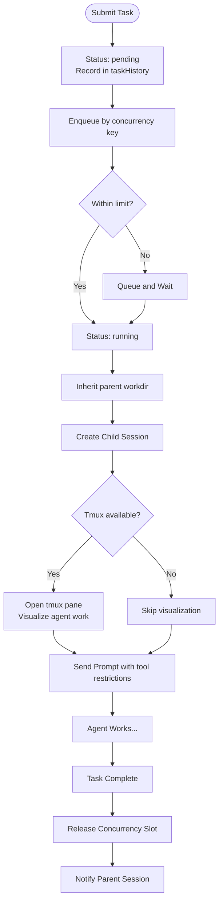

### 关键细节

**继承工作目录**：子智能体在父会话的工作目录里继续，保证项目上下文一致。

**工具限制**：

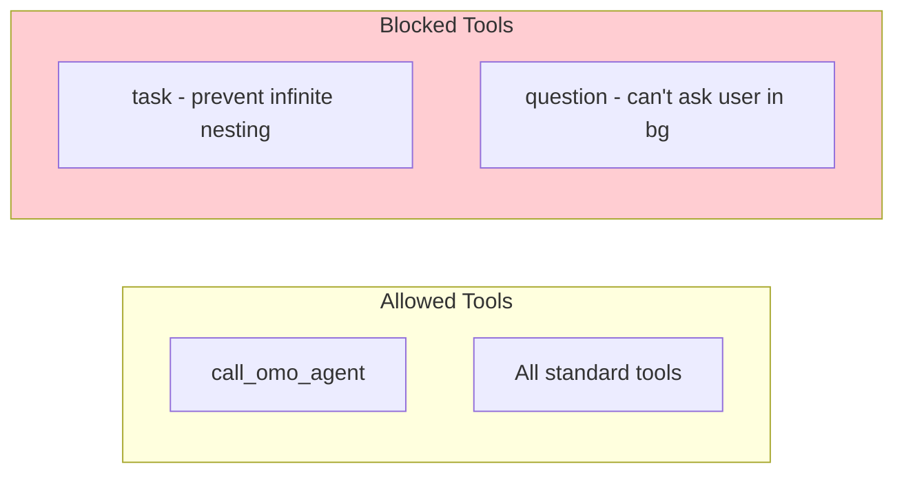

**tmux 可视化**：每个后台子智能体自动获得一个 tmux pane。

---

## 并发控制详解

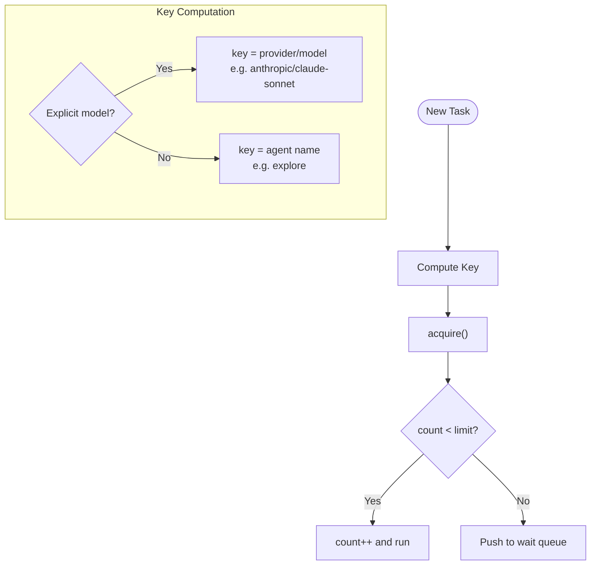

**释放时的 Handoff 机制**：

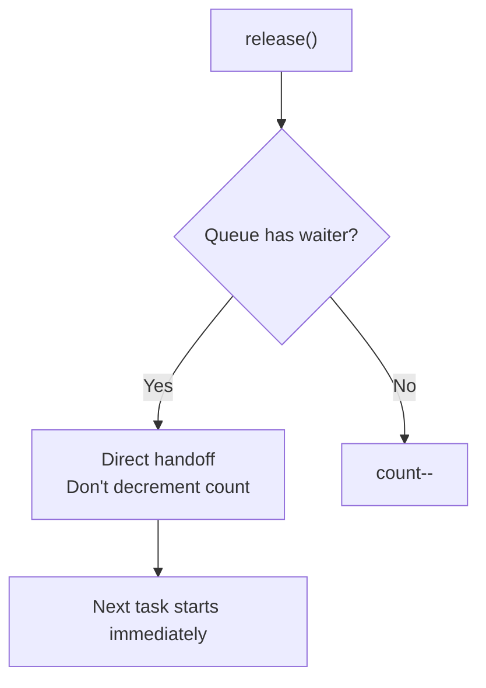

直接交接避免了"释放后被新任务抢走"的竞态问题。

---

## 父会话通知机制

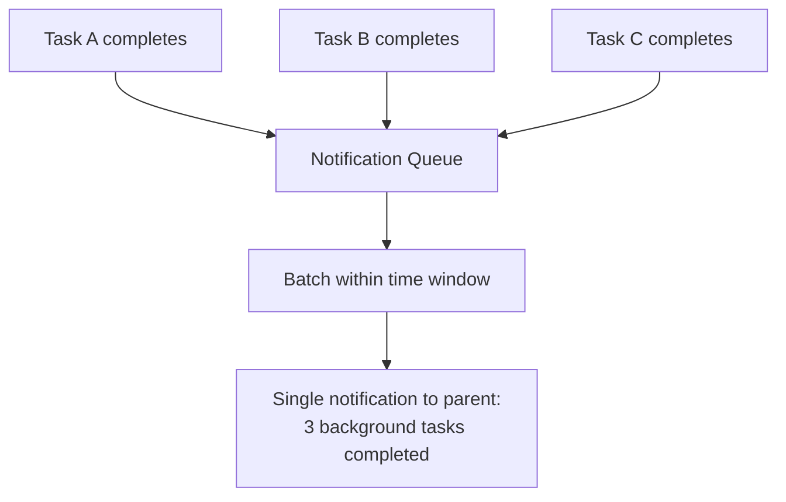

> 📁 **文件说明：`src/features/background-agent/manager.ts`**
> BackgroundManager 维护 notifications 队列、pendingByParent、completion timers、idle deferral timers 等。

**批量通知**：5 个后台任务完成时，不发 5 条独立通知——打包成一条，减少对主智能体的打断。

---

## Session 继续

### 路径 1：同步继续

> 📁 **文件说明：`src/features/background-agent/subagent-session-creator.ts`**
> 创建或复用子智能体 session。

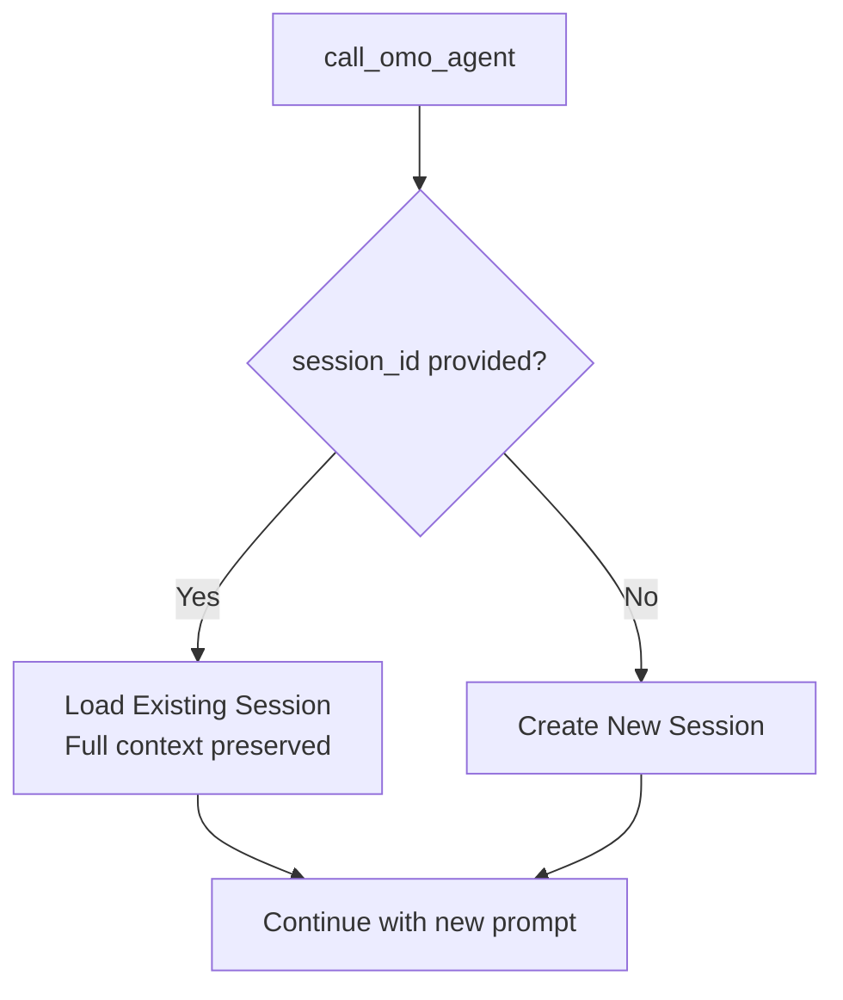

**省 70%+ token**：不用重新描述之前的结果，直接在已有上下文上继续。

### 路径 2：任务树追踪

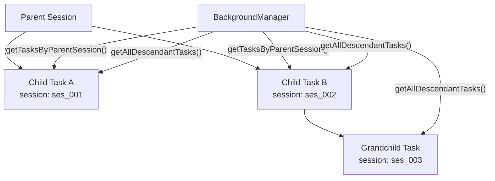

---

## Boulder State：长期计划持久化

> 📁 **文件说明：`src/features/boulder-state/storage.ts`**
> "巨石状态"存储。把长期计划持久化到 `.sisyphus/` 目录。

"Boulder"（巨石）来自西西弗斯神话——需要持续推进的长期计划。

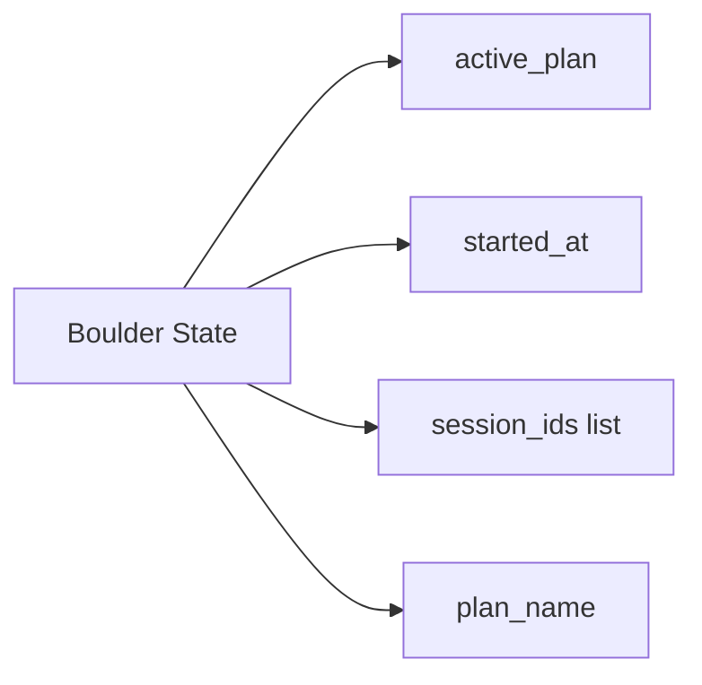

支持的操作：

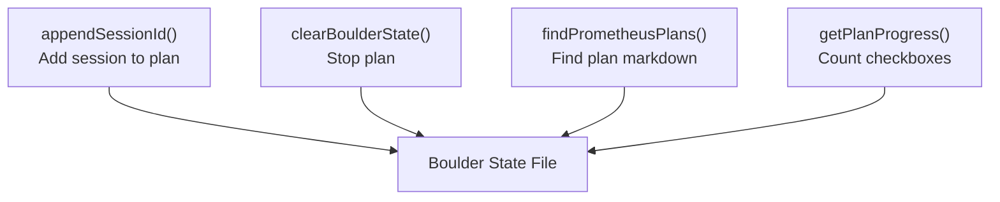

---

## 三层持久化架构

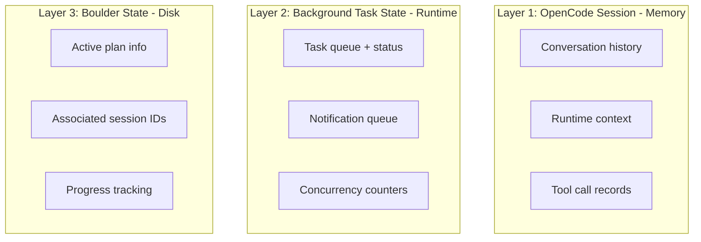

**中断恢复**：

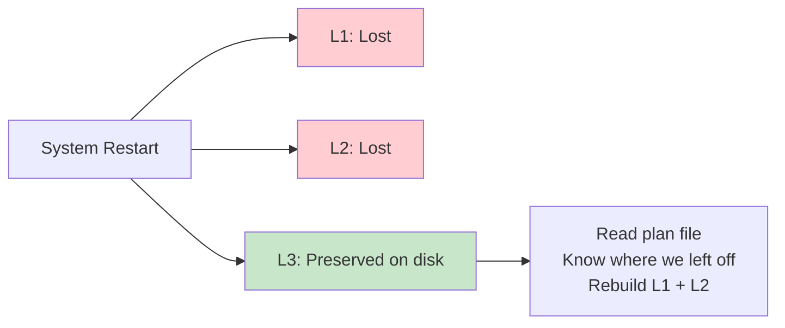

---

## 全景总结

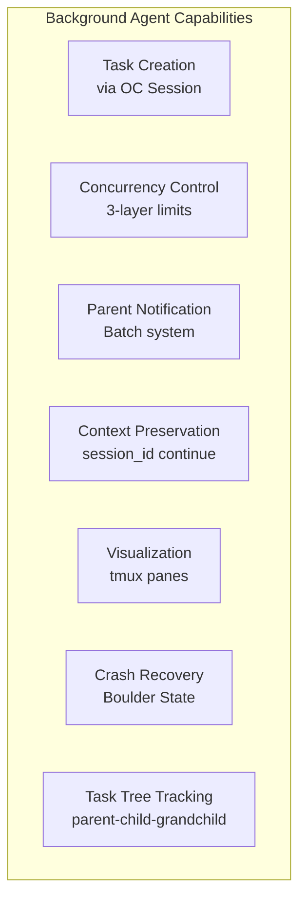

OMO 的后台智能体不是简单的异步 job——它们有 session、任务树、通知系统和计划持久化共同支撑。

---

## 本节要点

- **后台智能体 = 真正的 OpenCode session**：独立消息历史和工具链路
- **并发控制三层限额**：model → provider → default(5)，加 handoff 保证正确性
- **批量通知**：避免打断主智能体思路
- **session 继续**：通过 session_id 复用，节省 70%+ token
- **三层持久化**：Session(内存) → Task State(运行时) → Boulder State(磁盘)
- **子智能体有限制**：不能再派子任务、不能向用户提问
