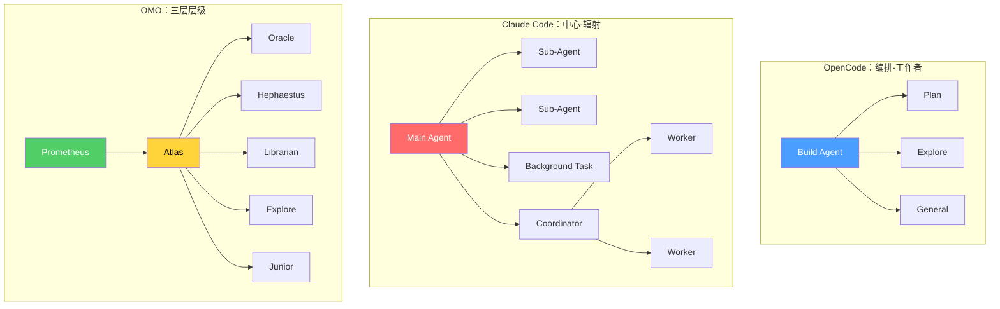

> **模型**: openai/gpt-5.4  
> **生成日期**: 2026-04-01  
> **书名**: Claude Code VS OpenCode：架构、设计与未来  
> **章节**: 第15章 — 智能体编排对比  
> **Token用量**: 约 4,900 input + 1,260 output

# 15.1 编排模式分类

很多人一提“多智能体系统”，就默认它们差不多：无非是多开几个 agent 并行干活。但真正重要的，不是“数量”，而是**任务、权限、上下文、结果整合是如何流动的**。如果不把这些结构分开讨论，所谓“支持多智能体”其实没有太多分析价值。

在 OpenCode、Oh-My-OpenCode（OMO）和 Claude Code 之间，最有代表性的五种编排模式分别是：**Orchestrator-Worker（编排者-执行者）**、**Pipeline（流水线）**、**Swarm（群体协作）**、**Mesh（网状协作）**、**Hierarchical（层级式）**。

先看 **Orchestrator-Worker**。这是一种最容易理解的模式：一个主智能体负责拆解问题、分派子任务、回收结果、做最终整合。OMO 最明显地采用了这种模式。它有父会话、有 delegate-task、有后台子智能体、有结果通知机制，整个系统的感觉就是“主控智能体带着一批工人智能体工作”。Claude Code 也支持类似结构，尤其是在 Task 工具、后台任务和子代理能力上。但 Claude Code 把这件事做得更产品化，用户感知到的是“可以派任务出去”。OpenCode 本身则更偏底层能力提供者：它支持 agent、subtask、command，但不强加一整套重监督编排体系。

再看 **Pipeline**。Pipeline 不是“很多智能体一起讨论”，而是“工作按阶段流动”。在计算机系统里，流水线强调的是阶段化处理：上一阶段输出成为下一阶段输入。OpenCode 天然带有这种味道，因为它的核心就是 ReAct 风格执行循环：理解、调用工具、观察结果、继续推进。OMO 则把流水线推进到了策略层：消息变换、工具前置守卫、续跑逻辑、通知逻辑、上下文注入逻辑，这些都像是一道道处理工序。Claude Code 也很像 Pipeline 系统，只不过它更多把流水线放在权限、安全、压缩和产品交互层。所以三者都使用 Pipeline，但 Pipeline 所在的层不一样：OpenCode 的流水线更像执行骨架，OMO 的流水线更像策略中间层，Claude Code 的流水线更像商业产品中的安全与体验流程。

第三种是 **Swarm**。这个词不是传统教材里常见的标准术语，在这里可以理解为“群体式并行协作模式”：多个智能体并行探索，中心控制相对较弱，更强调广度覆盖而不是严格阶段顺序。Swarm 特别适合大仓库搜索、多个方案并行尝试、外部资料快速扫描这类任务。三者里，OMO 最接近真正可用的 swarm。因为它明确支持后台并发、按模型/提供商限流、角色化子智能体，以及结果回收。Claude Code 也能做出某种 swarm 效果，但更像是“受控的后台并行助手”。OpenCode 单体本身则不太具有 swarm 倾向，更多是你可以基于它搭，而不是它天生朝这个方向设计。

第四种是 **Mesh**。这个词也需要解释。Mesh 指“网状结构”，在 agent 语境里就是多个智能体之间横向交流，而不是所有信息都必须经过一个总控节点。Mesh 很灵活，但也很难控，因为横向传播容易带来重复、冲突和上下文漂移。严格说，这三个系统都不是纯粹的 mesh。它们都更偏有中心的编排，而不是完全去中心化。不过 OMO 有一些弱 mesh 特征：前面子智能体产出的智慧、经验、摘要，可以被后面的智能体继承，这种“通过共享智慧间接互相影响”的方式，形成了一种非直接对话的网状耦合。Claude Code 在多个 task 汇总回主上下文时，也会出现一点点类似 mesh 的影子。OpenCode 则更像提供底层网络接口，但不定义网络拓扑。

第五种是 **Hierarchical**，即层级式编排。层级式不是简单的主从，而是多个抽象层级同时存在：例如上层做计划，中层做协调，下层做执行或验证。这类模式特别适合复杂工程问题，因为“规划”“搜索”“编辑”“审计”并不处在同一个抽象层。OMO 是三者里最强的层级式系统：它不仅有多角色 agent，还有语义类别、hook 约束、续跑机制、工具权限限制。Claude Code 也有层级性，但更柔和：主 agent 可以派任务、收结果、再次上升到总控角色。OpenCode 仍然更像层级结构的基础设施，而不是层级本身。

可以把它们简单概括成一张表：

| 模式 | OpenCode | OMO | Claude Code |
|---|---|---|---|
| 编排者-执行者 | 基础支持 | 很强，明确外显 | 很强，但更产品化 |
| 流水线 | 核心执行方式 | 核心策略方式 | 核心安全/体验方式 |
| 群体协作 | 原生较弱 | 三者最强 | 中等 |
| 网状协作 | 主要靠开发者自建 | 通过智慧共享呈现弱形态 | 通过任务汇总呈现弱形态 |
| 层级式 | 可做但不强调 | 一等公民 | 存在但较松散 |

这一章最重要的结论，不是“谁支持多智能体更多”，而是：**谁把编排拓扑做成了系统级设计对象**。OpenCode 的优点是简洁、开放、容易改造；它像一个很好的底座。OMO 的优点是把编排本身抬升成运行时能力，不只是“能派任务”，而是“能持续监督、并行、限制、整合”。Claude Code 则介于两者之间：它既承认多智能体的价值，又尽量把复杂性包进产品体验里。

所以，真正好的比较方式，不是问“它是不是多智能体”，而是问：“它优化了哪种编排模式？为了什么目标？付出了什么成本？”

## Claude Code 的编排实践

> **Model**: openai/gpt-5.4  
> **Token Usage**: 当前API环境不可见

如果把上一节的分类真正落到具体系统上，那么 Claude Code 最适合被描述成一种 **Hub-and-Spoke（枢纽-辐射式）** 编排结构，并在需要时叠加 **Coordinator mode** 形成更正式的多智能体协调。

这里先解释一下 **Hub-and-Spoke**。这个说法在系统设计、网络设计、供应链设计里很常见，但并不是国内 CS 教材中最常见的标准术语。它指的是：一个中心节点（hub）负责接收需求、分发任务、整合结果；多个外围节点（spokes）分别执行局部工作，但它们本身通常不是新的控制中心。把这个结构放到 Claude Code 里看，就非常直观：主 agent 或 coordinator 是 hub，被派生出来的 sub-agents、background tasks 是 spokes。

在这种结构里，**AgentTool** 就是创建 spoke 的核心机制。主 agent 通过 AgentTool 派生一个新 agent，把一个边界相对清晰的问题交给它。**TaskCreateTool** 以及整组 Task tools，则给这个 hub 增加了异步调度能力：中心节点不必一直阻塞等待，而是可以把任务发出去，让其在后台运行，再通过 **TaskGetTool**、**TaskListTool**、**TaskOutputTool** 在合适的时候查询状态、回收产出。**DreamTask** 则把这种作业管理能力拉长到更长时间尺度。

所以，Claude Code 的关键并不是“它也能开子任务”，而是：它把 **中心调度 + 异步回收 + 上下文隔离** 组合成了一个相对完整的编排模式。换句话说，它不是单纯多开几个 LLM 调用，而是在形成一种更接近轻量级 job system 的 agent runtime。

Claude Code 这个 runtime 的另一个关键点，是 **context isolation**。也就是说，hub 不会把自己完整的历史、全部噪音、全部任务残留无差别复制到每个 spoke 上，而是尽量只传递跟当前子任务相关的目标与约束。于是，Claude Code 不只是拓扑上呈现为 hub-and-spoke，在信息流上也体现为 **有防火墙的中心辐射结构**。

这恰恰是它和 OMO 最大的不同之一。OMO 更像一个 **三层层级体系**：Planning → Execution → Workers。也就是说，OMO 并不只区分“中心”和“外围”，还会更明确地区分规划层、执行层、工人层，不同层承担不同抽象级别的职责。Claude Code 虽然在 Coordinator mode 下也有一定层级感，但整体还是更平。中心更强，worker 更边界化，大多数结果最终还是回收到一个主要监督节点里，而不是经过多个中间管理层逐层流动。

这种“更平”的结构，并不意味着 Claude Code 就更弱。恰恰相反，它体现的是另一种优化方向。更平的 hub-and-spoke 有几个优点：

- 更容易理解，用户和系统都更容易知道谁是主控；
- 协议跳转更少，减少多层协调带来的额外摩擦；
- 更容易产品化和安全化，因为控制面相对集中；
- 更适合把多智能体能力包进一个商业产品，而不是把用户暴露给完整的 orchestration complexity。

对应地，它也有代价：中心节点负担会更重，很多整合责任仍然压在主 coordinator 身上。如果任务大到需要“规划者管理协调者，协调者再管理 worker”的程度，那么更深层级的体系可能会更有表达力。OMO 在这方面更像一个野心更大的 orchestration engine，而 Claude Code 更像一个经过裁剪、对产品友好的 orchestration runtime。

从这个角度再看 OpenCode，差异也会更清楚。OpenCode 更像提供 primitives：agent、tool、session、task-like 能力这些底座是有的，但它并没有强烈规定你必须采用什么编排拓扑。它是 builder-friendly 的。Claude Code 则更进一步，把一种相对成熟的工作模式直接包装出来。因此，同样是“支持 sub-agent”，在 OpenCode 那里往往意味着“你可以自己搭”，在 Claude Code 这里则更接近“系统已经替你组织出一种默认可用的多智能体形态”。

Claude Code 的 **SendMessageTool** 也值得在这个 taxonomy 中专门提一下。标准 hub-and-spoke 通常强调所有信息都回到中心再分发，但 SendMessageTool 允许运行中的 agents 之间进行有限的异步消息传递。它并没有把 Claude Code 变成真正的 **Mesh**，因为横向通信仍然不是默认主通路，系统也没有演化成全面去中心化的 peer network；但它确实给这个结构加了一点“侧信道”能力。更准确地说，Claude Code 是 **以 hub-and-spoke 为主、带有限 lateral messaging 的集中式系统**。

把三者放到更具体的特性表里，会更容易看清楚：

| Feature | OpenCode | OMO | Claude Code |
|---|---|---|---|
| Sub-agent spawning | task tool (basic) | delegate-task with category routing | AgentTool with context isolation |
| Background tasks | limited | 5 concurrent per model/provider | TaskCreate/Get/List/Output + DreamTask |
| Inter-agent messaging | none | parent session notification | SendMessageTool |
| Custom agent definitions | 4 built-in | 11 built-in + dynamic | `.claude/agents/` markdown + built-in |
| Orchestration pattern | Orchestrator-Worker | Hierarchical (3-layer) | Hub-and-Spoke + Coordinator |
| Context strategy | shared session | wisdom accumulation | context isolation (firewall) |

这张表能说明一个经常被忽略的事实：Claude Code 不是因为层级比 OMO 少，就代表它编排能力更“浅”。更准确的说法是，它把复杂度投资在了 **边界控制、异步任务治理、产品化编排协议** 上，而不是投资在更深的多层组织结构上。

所以，如果要把 Claude Code 在本章 taxonomy 里的位置说得更精确，可以概括为：

- 它比 OpenCode 的原生底座更有明确的 orchestration form；
- 它没有 OMO 那么厚重的三层分工，但胜在更平衡、更可控；
- 它对 context isolation 的强调，比另外两者都更鲜明；
- 它的 Task tools 让 hub 具备了明显的异步作业调度能力；
- 它通过 Coordinator mode 把这种结构进一步制度化。

如果借用一个衍生表达，可以把 Claude Code 的路线叫做 **practical orchestration minimalism**。这不是教材里的标准名词，这里指的是：不是追求“最多层、最多 agent、最复杂拓扑”，而是只保留那些能够稳定提升工程结果的编排能力——并且把它们限制在一个更容易维护、更容易审计、更容易被普通用户理解的边界内。

从设计方法论上看，这条路线的逻辑非常清楚：

1. 保留一个负责最终结果的中心；
2. 将边界明确的工作向外辐射委派；
3. 让部分工作以异步方式持续运行；
4. 在必要时允许有限的 agent-to-agent 消息；
5. 让结果以压缩形式回流；
6. 尽量维持上下文隔离，而不是让所有历史自然堆积。

这也是为什么 Claude Code 在多智能体实践中经常显得比较稳：它没有试图让用户管理一个完全展开的“智能体社会”，而是给出了一个经过约束的默认拓扑——一个中心、若干受边界约束的 spokes、可选的 coordinator 行为，以及受控制的信息流。放在本章的编排模式分类里，这就是 Claude Code 最清晰、也最具有辨识度的实践身份。
